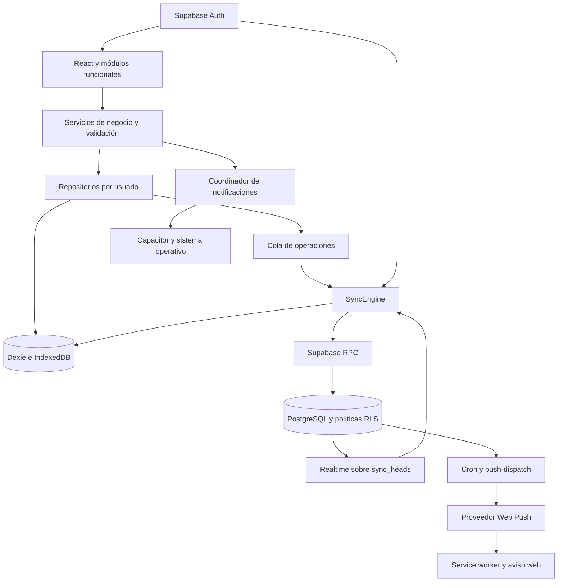

# Documentación técnica de Dayflow

Versión del proyecto 0.9.0 · Documento 1.0 · 9 de octubre de 2026

Dayflow reúne notas, tareas, calendario y recordatorios en una aplicación personal con almacenamiento local, sincronización mediante Supabase y distribución web, PWA y móvil. Este documento describe la implementación, sus contratos de datos, los procedimientos de desarrollo y operación y las validaciones disponibles. Su finalidad es servir como base técnica para mantenimiento, incorporación de desarrolladores y preparación de la documentación definitiva del producto.

Las nueve fases del plan original están implementadas como base de desarrollo. La web tiene una publicación documentada en Vercel; Android dispone de compilaciones de desarrollo y pruebas en emulador; iOS dispone de un proyecto generado y sincronizado, con compilación y ejecución física pendientes. La validación de entrega de notificaciones depende de la plataforma y del estado real del navegador o dispositivo.

## 1 Identificación y control de versión

| Dato                            | Valor                                                                    |
| ------------------------------- | ------------------------------------------------------------------------ |
| Nombre                          | Dayflow                                                                  |
| Versión declarada               | `0.9.0`                                                                  |
| Tipo de paquete                 | Privado, módulos ESM                                                     |
| Repositorio remoto configurado  | `https://github.com/ShadowStudioEnterprise/dayflow.git`                  |
| Carpeta de trabajo              | `D:\Projects\dayflow`                                                    |
| Rama revisada                   | `main`                                                                   |
| Commit revisado                 | `a9f5d46`                                                                |
| Fecha del commit                | 4 de octubre de 2026                                                     |
| Mensaje del commit              | `Update Dayflow production domain and auth redirects`                    |
| Commit anterior                 | `1ce39b5`, incorporación inicial de la aplicación y despliegue en Vercel |
| Dirección principal documentada | `https://dayflow-by-shadowstudio.vercel.app`                             |
| Entrada de autenticación        | `/auth/login`                                                            |
| Alojamiento anterior            | `https://dayflow-productividad.gptgonzaleznavarrete.chatgpt.site`        |
| Idioma de interfaz              | Español                                                                  |

Las evidencias de ejecución más recientes recogidas en las guías corresponden al 4 de octubre de 2026. Los resultados de diferentes revisiones se conservan con su alcance; no deben interpretarse como una ejecución única de todas las suites sobre el mismo commit. Las operaciones de publicación y configuración remota deben quedar vinculadas a una versión de código y a sus artefactos.

## 2 Índice del documento

1. Identificación y control de versión
2. Índice del documento
3. Alcance del producto
4. Tecnologías y requisitos
5. Estructura del repositorio
6. Arquitectura y responsabilidades
7. Navegación y experiencia de interfaz
8. Autenticación y ciclo de sesión
9. Modelo de datos y validación
10. Persistencia local y transacciones
11. PostgreSQL y migraciones
12. Contrato de sincronización
13. Fechas y recurrencias
14. Implementación de los módulos
15. Notificaciones nativas
16. Notificaciones Web Push
17. PWA y actualización de versiones
18. Android e iOS
19. Variables y configuración por entorno
20. Desarrollo local y Supabase alojado
21. Compilación y publicación
22. Estrategia de pruebas y evidencias
23. Seguridad y privacidad
24. Operación y recuperación de errores
25. Límites y trabajo pendiente
26. Decisiones de arquitectura
27. Plan de mantenimiento de la documentación
28. Referencias internas y glosario
29. Inventario exacto de dependencias y comandos
30. Diccionario de tipos del dominio
31. Diccionario del esquema SQL

## 3 Alcance del producto

Dayflow organiza información personal bajo una cuenta autenticada. Sus módulos principales son Hoy, Tareas, Notas, Calendario, Recordatorios, Inbox, Etiquetas, Búsqueda, Relaciones, Perfil y Configuración. Los documentos se consultan desde IndexedDB, de modo que la interfaz puede continuar trabajando sin red cuando la aplicación y la sesión están disponibles.

La aplicación ofrece creación rápida, formularios detallados, filtros, búsqueda, persistencia reactiva y recuperación de fallos. La PWA permite precargar los recursos de interfaz y abrir rutas sin conexión. El contenedor Capacitor empaqueta el mismo frontend para Android e iOS y añade integración con el ciclo de vida y las notificaciones del sistema operativo.

La sincronización está diseñada para varias instalaciones de una misma cuenta. El sistema conserva cambios pendientes y copias de conflictos. La colaboración entre varios propietarios, la edición conjunta con fusión de texto, la inteligencia artificial y los adjuntos mediante Storage quedan fuera de las funciones actuales.

Fuentes: `README.md`, `docs/implementation-plan.md`, `src/app/router/router.tsx` y `src/features/`.

## 4 Tecnologías y requisitos

| Capa              | Tecnologías                                                 | Función                                                     |
| ----------------- | ----------------------------------------------------------- | ----------------------------------------------------------- |
| Interfaz          | React 19, React DOM 19, TypeScript 6                        | Componentes, tipado y composición de pantallas              |
| Compilación       | Vite 8 y plugin React                                       | Desarrollo y empaquetado del frontend                       |
| Estilos           | Tailwind CSS 4, CSS propio, Lucide                          | Diseño, variables semánticas e iconos                       |
| Navegación        | React Router 7                                              | Rutas, carga por demanda y protección de acceso             |
| Formularios       | React Hook Form, resolvers y Zod 4                          | Validación y estados de formulario                          |
| Preferencias      | Zustand 5                                                   | Apariencia, zona, formato horario y navegación              |
| Estado remoto     | TanStack Query 5                                            | Infraestructura de consultas y limpieza de caché por sesión |
| Datos locales     | Dexie 4 y dexie-react-hooks                                 | IndexedDB, transacciones y observación reactiva             |
| Backend           | Supabase JS 2, PostgreSQL, Auth y Realtime                  | Identidad, almacenamiento remoto y propagación              |
| Notas             | TipTap 3 y ProseMirror                                      | Documento enriquecido y normalización de contenido          |
| Fechas            | Temporal polyfill y rrule                                   | Zonas horarias y expansión de recurrencias                  |
| PWA               | vite-plugin-pwa y Workbox                                   | Manifest, precarga y ciclo de actualización                 |
| Nativo            | Capacitor 8, App y Local Notifications                      | Android, iOS, callbacks y alarmas                           |
| Pruebas           | Vitest, Testing Library, fake-indexeddb, PGlite, Playwright | Unidad, componentes, SQL e integración                      |
| Calidad           | Oxlint y Prettier                                           | Análisis estático y formato                                 |
| Recursos gráficos | Sharp                                                       | Generación de iconos                                        |
| Emisor Push       | Deno y web-push                                             | Cifrado, firma VAPID y envío al proveedor                   |

`package.json` exige Node.js `>=24.0.0`; el inicio rápido recomienda Node 24 LTS y npm. Las versiones resueltas se fijan en `package-lock.json`, que debe conservarse y utilizarse con `npm ci`. Los rangos completos y las versiones resueltas de dependencias directas se incluyen en el apartado 29.

TypeScript usa modo estricto, `noUncheckedIndexedAccess`, comprobación de variables y parámetros sin uso, `noFallthroughCasesInSwitch`, objetivo ES2023, resolución de módulos para bundler y JSX `react-jsx`. El build ejecuta `tsc -b` antes de Vite.

Oxlint habilita los plugins React, TypeScript y OXC; las reglas de hooks son errores y la exportación de componentes es aviso, con constantes permitidas. Excluye la exportación generada de Sites. Prettier usa comillas simples, ausencia de punto y coma y comas finales. No hay una configuración de workflows CI versionada entre los archivos revisados; los comandos disponibles constituyen la base para definirla.

Para el backend local se necesita Docker Desktop con contenedores Linux. Android requiere JDK 21 y Android SDK 36. iOS requiere macOS y Xcode 26 o posterior según la guía del proyecto. Estos requisitos describen la configuración de Dayflow; no son una comprobación de versiones externas en tiempo real.

## 5 Estructura del repositorio

```text
src/
  app/
    providers/        composición de proveedores y sesión
    router/           rutas y barreras de acceso
    layouts/          navegación, barra lateral y Mi espacio
    store/            preferencias locales
  features/
    auth/             formularios de identidad
    dashboard/        Hoy y preparación pública
    tasks/            tareas y subtareas
    notes/            notas y editor
    calendar/         vistas y proyecciones de calendario
    events/           edición y expansión de eventos
    reminders/        recordatorios y permisos
    sync/             estado, dispositivos y recuperación
    inbox/            captura y conversión
    search/           búsqueda agrupada
    tags/             etiquetas y asociaciones
    relations/        vínculos entre documentos
    profile/          perfil y estadísticas
    settings/         configuración e instalación
  services/
    database/         Dexie y repositorios
    supabase/         cliente, Auth y adaptación de filas
    sync/             transporte, motor, codecs y conflictos
    notifications/    coordinación y adaptadores de avisos
    native/           enlaces y runtime Capacitor
    pwa/              registro y estado del worker
  shared/
    components/       componentes comunes
    hooks/            conectividad y reloj
    types/            modelos de dominio
    utils/            fechas, recurrencias, búsqueda e IDs
    validation/       esquemas Zod
  test/               preparación y seguridad SQL
e2e/                  escenarios Playwright
supabase/
  migrations/         seis migraciones versionadas
  functions/
    push-dispatch/    emisor Web Push
scripts/              backend, Android, iconos y releases
public/               favicon, iconos y push-worker.js
android/              proyecto Android y variante local
ios/                  proyecto Xcode con Swift Package Manager
deployment/           configuración alojada y exportación Sites
docs/                 documentación funcional y técnica
```

`dist/` contiene la compilación web. `dist-pwa-test/` y las carpetas `test-results*` son artefactos de verificación. `.toolchains/` contiene herramientas y evidencias locales ignoradas. `.vercel/` almacena la vinculación local del proyecto. `deployment/web/` es una exportación separada para Sites, excluida del repositorio principal.

## 6 Arquitectura y responsabilidades

La arquitectura separa interfaz, servicios de negocio, persistencia y transporte remoto. Los componentes no escriben directamente en las tablas de Supabase. Los servicios de cada módulo aplican reglas de negocio y validan datos; los repositorios operan bajo un UUID de usuario; el motor de sincronización intercambia snapshots mediante RPC.



`AppProviders` y `AuthProvider` coordinan servicios comunes. El proveedor de autenticación limpia la caché de Query ante eventos de Auth, espera la restauración inicial y libera su suscripción. `SyncRuntime` crea y detiene el motor por sesión; `NotificationRuntime` conecta avisos con la identidad y el ciclo de vida nativo. Los repositorios deben reconstruirse al cambiar de cuenta.

Zustand almacena preferencias, mientras que los documentos residen en Dexie. La base local es compartida por instalación y se filtra por `userId`. Las lecturas derivadas de Hoy, Perfil y Búsqueda no crean documentos ni operaciones de sincronización.

La carga por demanda de páginas y editores limita el código inicial. Vite separa paquetes de React, Supabase y Zod. Se reutilizan componentes propios pequeños y el elemento nativo `<dialog>` para los modales. La interfaz no carga fuentes externas.

Fuentes: `docs/architecture.md`, `src/app/providers/`, `src/services/database/`, `src/services/sync/` y `vite.config.ts`.

## 7 Navegación y experiencia de interfaz

| Ruta                       | Acceso                | Función                                     |
| -------------------------- | --------------------- | ------------------------------------------- |
| `/`                        | Sesión restaurada     | Panel Hoy                                   |
| `/tasks`                   | Privado               | Tareas y subtareas                          |
| `/notes`                   | Privado               | Listado y editor de notas                   |
| `/calendar`                | Privado               | Calendario y apertura de editores           |
| `/reminders`               | Privado               | Recordatorios                               |
| `/inbox`                   | Privado               | Capturas                                    |
| `/tags`                    | Privado               | Gestión de etiquetas                        |
| `/search`                  | Privado               | Búsqueda completa                           |
| `/profile`                 | Privado               | Perfil y estadísticas                       |
| `/settings`                | Privado               | Preferencias, sincronización e instalación  |
| `/setup` y rutas hijas     | Público               | Preparación y navegación sin datos privados |
| `/auth/login`              | Público               | Inicio de sesión                            |
| `/auth/register`           | Público               | Registro                                    |
| `/auth/reset-password`     | Público               | Solicitud de recuperación                   |
| `/auth/update-password`    | Flujo de recuperación | Cambio de contraseña                        |
| Cualquier ruta desconocida | Público               | Mensaje de ruta inexistente                 |

`RequireAuth` espera a la restauración antes de decidir acceso o redirección. El flujo de recuperación tiene su ruta específica. La vista pública de preparación permite explorar navegación y preferencias sin crear una cuenta ni leer registros personales.

`N` fuera de campos abre creación rápida. `Ctrl/Cmd+K` abre búsqueda agrupada. Se conserva `Ctrl/Cmd+N` del navegador. Los diálogos gestionan foco, Escape y retorno al control que los abrió. Formularios de tareas y eventos advierten antes de descartar cambios; las notas fuerzan su autoguardado al navegar.

El menú Mi espacio enlaza Perfil y Configuración y permite cerrar sesión con estado ocupado, protección frente a pulsaciones repetidas y tratamiento de errores. Admite teclado, cierre exterior y navegación desde una barra contraída. Las revisiones visuales documentadas incluyen anchura de 320 px y tema oscuro; estas revisiones no equivalen a una auditoría integral de accesibilidad.

Fuentes: `src/app/router/router.tsx`, `src/app/router/RouteBoundaries.tsx`, `src/app/layouts/` y `src/shared/components/`.

## 8 Autenticación y ciclo de sesión

El cliente Supabase se crea únicamente si la URL y la clave pública cumplen la validación inicial. Configura `persistSession: true`, `autoRefreshToken: true`, `detectSessionInUrl: true` y `flowType: 'pkce'`. Si falta configuración, `requireSupabase` informa de que se deben configurar las variables para activar la cuenta.

`authService` ofrece inicio de sesión con contraseña, registro, recuperación, actualización de contraseña y cierre de sesión. El registro guarda el nombre en los metadatos de Auth y solicita confirmación por correo. Los esquemas de registro y cambio de contraseña exigen entre 12 y 128 caracteres; el login sólo exige que la contraseña introducida no esté vacía. El nombre se recorta y admite de 1 a 100 caracteres; el correo se valida con Zod.

La configuración alojada conserva confirmación de email, doble confirmación de cambios de dirección y cambio seguro de contraseña. No habilita un acceso anónimo alternativo. Las cuentas temporales confirmadas por administración en pruebas de integración no acreditan entrega real de correo.

PKCE exige abrir el enlace de confirmación o recuperación en el navegador, perfil o instalación que conserva el verificador. En web se usa el origen correspondiente y `/auth/update-password` para recuperación. En nativo se registran `dayflow://auth/callback` y `dayflow://auth/callback?next=recovery`, con validación de destino y deduplicación del código. El lector rechaza tokens en fragmentos y retornos arbitrarios.

El cierre de sesión usa `scope: 'local'`: cierra la sesión de esta instalación. Antes de salir cancela avisos nativos o da de baja Web Push y retira avisos propios. IndexedDB conserva documentos y cola pendiente para evitar pérdida de cambios; las rutas privadas quedan bloqueadas y los repositorios impiden consultar datos de otra cuenta. La conducta documentada del SDK ante un error 503 también elimina la sesión local, por lo que la interfaz no debe presuponer que un error remoto conserva el acceso.

Fuentes: `src/services/supabase/client.ts`, `auth-service.ts`, `src/shared/validation/auth-schemas.ts`, `src/services/native/auth-links.ts` y `deployment/supabase/config.toml`.

## 9 Modelo de datos y validación

### 9.1 Entidad común

Las entidades sincronizadas usan `id` y `userId` como UUID; `createdAt` y `updatedAt` como cadenas ISO; `deletedAt` opcional como marca de borrado; y `version` como entero positivo. El dominio usa camelCase y PostgreSQL snake_case. El codec valida auditabilidad y propietario al decodificar respuestas.

| Entidad del dominio | Tabla remota                           | Contenido principal                             |
| ------------------- | -------------------------------------- | ----------------------------------------------- |
| `Task`              | `tasks`                                | Título, estado, prioridad, fechas y recurrencia |
| `Subtask`           | `subtasks`                             | Tarea padre, posición y completado              |
| `Note`              | `notes`                                | Documento JSON, texto derivado y organización   |
| `CalendarEvent`     | `events`                               | Intervalo, zona, día completo y repetición      |
| `Reminder`          | `reminders`                            | Instante de aviso, zona y asociación opcional   |
| `Tag`               | `tags`                                 | Nombre y color                                  |
| `InboxItem`         | `inbox`                                | Título de captura                               |
| `Device`            | `devices`                              | Plataforma y última actividad                   |
| `EntityLink`        | `entity_links`                         | Dos extremos de nota, tarea o evento            |
| `EntityTag`         | `note_tags`, `task_tags`, `event_tags` | Asociación de entidad y etiqueta                |

`profiles` tiene `user_id` como clave primaria y campos de nombre y zona. El perfil de Auth y las preferencias locales no forman parte de la cola de entidades. `Device.platform` admite `desktop` en el contrato, aunque no existe una aplicación nativa de Windows documentada. `pushToken` es un campo del modelo de dispositivos; las suscripciones Web Push se gestionan mediante tablas independientes.

### 9.2 Reglas compartidas

Los títulos se recortan y admiten entre 1 y 300 caracteres. Las descripciones y textos opcionales compartidos admiten hasta 10.000 caracteres. Los colores admiten hasta 30 caracteres. Las reglas RRULE admiten hasta 1.000 caracteres y deben ser válidas para el parser compartido. Las zonas se validan mediante `Intl.DateTimeFormat` y los triggers SQL verifican su existencia.

Las tareas admiten estados `pending`, `in_progress`, `completed` y `cancelled`; prioridades `none`, `low`, `medium`, `high` y `urgent`. Una recurrencia exige vencimiento. Un inicio con hora no puede ser posterior al vencimiento con hora. En eventos, el final debe ser posterior al inicio y el tipo de fecha debe corresponder a `allDay`. Un recordatorio admite como máximo una asociación a tarea, evento o nota.

Las restricciones SQL vuelven a aplicar pertenencia, integridad y tipos, pero no todas las longitudes del esquema Zod están duplicadas como `CHECK` de PostgreSQL. La documentación de integración debe describir ambas capas y no asumir que son idénticas.

El diccionario completo de interfaces está en el apartado 30 y el de columnas SQL en el 31. Fuentes: `src/shared/types/domain.ts`, `src/shared/validation/schemas.ts`, `src/services/supabase/persistence.ts` y migraciones.

## 10 Persistencia local y transacciones

La base Dexie se llama `dayflow` por defecto. Los repositorios se crean con un UUID de usuario obligatorio. `findById` descarta documentos de otro propietario o borrados; `findAll` consulta el índice de propietario y excluye tombstones. Las escrituras vuelven a validar el contenido con el esquema de la entidad.

Cada creación, actualización, restauración o borrado escribe el documento y un snapshot de operación en `syncQueue` dentro de una transacción. La operación incluye UUID propio, propietario, entidad, identificador, acción, payload, fecha y reintentos. Si una escritura falla, se revierte la transacción; la UI sólo puede confirmar guardado tras el commit. Las acciones optimistas revierten si falla el repositorio.

En actualizaciones y borrados, `updatedAt` avanza al menos un milisegundo respecto al valor anterior, y `version` aumenta. `createdAt` y propietario se conservan. `remove` añade `deletedAt`; `restore` conserva el UUID, retira el borrado y registra una nueva escritura. La creación usa `add`, de modo que un ID existente no se sobrescribe silenciosamente.

| Versión Dexie | Almacenes incorporados                                              | Índices relevantes                                                        |
| ------------- | ------------------------------------------------------------------- | ------------------------------------------------------------------------- |
| 1             | Las doce entidades y `syncQueue`                                    | ID, propietario; actualización; vencimiento, inicio o padre según entidad |
| 2             | `notificationJobs`, `notificationStates`, `notificationPreferences` | ID autoincremental, propietario y recordatorio                            |
| 3             | `syncCheckpoints`, `syncReplicas`, `syncConflicts`                  | Propietario, clave de réplica y entidad en conflicto                      |

Los almacenes de notificaciones son específicos del dispositivo. `Reminder.notificationId` no se envía a Supabase ni genera cambios de contenido. Las réplicas retienen la última versión remota, los checkpoints almacenan cursor y estado, y los conflictos conservan snapshots locales recuperables.

IndexedDB no está cifrada por la aplicación. Borrar los datos del sitio o sufrir la expulsión de almacenamiento del navegador puede eliminar tanto documentos como pendientes. El cierre de sesión conserva estos datos, pero bloquea su acceso desde la aplicación.

Fuentes: `src/services/database/database.ts`, `repository.ts`, `src/services/sync/types.ts` y `docs/database.md`.

## 11 PostgreSQL y migraciones

### 11.1 Evolución del esquema

| Orden | Archivo                                | Cambio                                                             |
| ----- | -------------------------------------- | ------------------------------------------------------------------ |
| 1     | `202609200001_foundation.sql`          | Entidades, perfil, relaciones, auditoría, claves, índices y RLS    |
| 2     | `202609200002_task_recurrence.sql`     | Zona, ancla y sucesora de tareas; restricciones e índice de estado |
| 3     | `202609240003_reminder_timezone.sql`   | Zona IANA de recordatorios y validación                            |
| 4     | `202609240004_sync.sql`                | Historial, cabecera, metadatos, acuses y RPC idempotentes          |
| 5     | `202610040005_web_push.sql`            | Suscripciones, reservas de entrega y RPC de Web Push               |
| 6     | `202610090006_security_privileges.sql` | Revocación de EXECUTE sobrante y defaults restrictivos de cliente  |

Se aplican sólo las migraciones pendientes y en orden. La migración 4 incorpora registros existentes al historial, instala triggers y revoca escritura cliente directa en las entidades sincronizadas. El frontend debe usar RPC después de este cambio; desplegar un cliente antiguo con escrituras directas resulta incompatible.

El esquema final definido por las migraciones contiene 19 tablas públicas: 14 de Foundation, tres nuevas para sincronización y dos para Push. Este inventario describe SQL versionado; la primera verificación alojada registró 17 tablas antes de añadir Web Push.

### 11.2 Integridad y políticas

Las entidades tienen propietario y clave única `(user_id, id)`. Las claves foráneas de subtareas, recordatorios, asociaciones de etiquetas y sucesoras de tareas incluyen `user_id`. Un trigger valida los extremos de `entity_links`, ya que su tipo es polimórfico. Las autorrelaciones se rechazan.

Los índices priorizan propietario, actualización y fechas. Hay unicidad parcial para etiquetas activas por nombre normalizado con `lower(name)` y para asociaciones activas de entidad y etiqueta. Una colisión de nombres creada en dos instalaciones offline conserva la operación rechazada para revisión; no hay una fusión automática de etiquetas.

RLS limita las lecturas al propietario. Tras Sync, las escrituras de entidades y acuses están controladas por RPC. El cliente no dispone de DELETE físico de documentos. Las funciones con privilegios usan `search_path` vacío y validan identidad; los helpers internos no están concedidos al cliente. La baja de suscripciones Push es una excepción deliberada: permite DELETE al propietario de su suscripción.

El trigger de alta de Auth crea un perfil. El trigger de auditoría conserva creación y propietario, aumenta revisión y coopera con el sello lógico de Sync. El historial y los acuses no tienen purgado automático; Push sí limpia registros de entrega antiguos conforme a su política de 14 días.

La migración 6 revoca EXECUTE de los cinco triggers a `PUBLIC`, `anon` y `authenticated`. Los futuros objetos creados por `postgres` en `public` necesitan GRANT explícito para clientes. La revocación del default de EXECUTE de `PUBLIC` afecta globalmente a futuras funciones de ese propietario; no altera otras funciones existentes. Las pruebas con JWT reales y la corrección desplegada se registran en [verificación](verification.md).

### 11.3 Tablas de sincronización y Push

`sync_heads` guarda `last_seq` por usuario. `sync_changes` guarda `(user_id, seq)`, entidad, snapshot `row_data` y sello `stamp`. `sync_records` identifica el cambio vigente de cada entidad y no ofrece escritura cliente. `sync_operations` conserva el resultado idempotente en `result`.

`push_subscriptions` almacena endpoint, material público de suscripción, propietario y fechas. `push_deliveries` tiene clave primaria por suscripción, recordatorio e instante; registra lease, intentos y aceptación. Los clientes pueden leer y eliminar sus suscripciones y registrarlas mediante RPC; sólo el emisor privilegiado accede a candidatos y reservas.

Fuentes: `supabase/migrations/`, `docs/database.md`, `docs/sync.md` y `docs/web-push.md`.

## 12 Contrato de sincronización

### 12.1 Ciclo del motor

`SyncRuntime` construye un motor por cuenta, registra el dispositivo y libera timers, peticiones y suscripciones al salir. El motor descarga cambios, ordena la cola por dependencias, envía snapshots y vuelve a descargar el historial. El transporte comprueba que la sesión coincide con el propietario antes de cada petición.

Web Locks serializa motores de pestañas de un mismo perfil. En entornos sin esa API se usa un mutex en memoria; la idempotencia del servidor protege los reintentos de otros contextos. La actividad de dispositivo se actualiza aproximadamente cada 15 minutos mientras el motor está activo.

Realtime escucha exclusivamente `sync_heads` con filtro por usuario. Su evento actúa como señal para descargar por cursor; el orden del WebSocket no es el contrato de consistencia. Se comprueba periódicamente cada 30 segundos y al recuperar conectividad o reanudar. Cada petición tiene timeout de 15 segundos y AbortSignal; respuestas tardías de una sesión cancelada no deben modificar la base local.

### 12.2 RPC de escritura

Entrada: `dayflow_apply_operation(p_operation jsonb)`. Está concedida a `authenticated` y usa la identidad de `auth.uid()`.

```json
{
  "id": "00000000-0000-4000-8000-000000000001",
  "entity": "tasks",
  "entityId": "00000000-0000-4000-8000-000000000002",
  "action": "create",
  "row": {
    "id": "00000000-0000-4000-8000-000000000002",
    "user_id": "00000000-0000-4000-8000-000000000003",
    "created_at": "2026-10-09T08:00:00.000Z",
    "updated_at": "2026-10-09T08:00:00.000Z",
    "deleted_at": null,
    "version": 1,
    "title": "Preparar documentación",
    "description": null,
    "status": "pending",
    "priority": "medium",
    "start_at": null,
    "due_at": null,
    "due_date": "2026-10-09",
    "recurrence_rule": null,
    "timezone": null,
    "recurrence_anchor": null,
    "next_occurrence_id": null,
    "completed_at": null
  }
}
```

El ejemplo ilustra el formato; el UUID de propietario debe coincidir con la sesión real. El codec `encodeOperation` produce el contrato y no envía directamente un objeto de dominio. El servidor admite una lista cerrada de entidades, rechaza campos desconocidos, verifica auditoría y limita la operación a 2 MiB.

La RPC serializa escrituras de una cuenta mediante un bloqueo transaccional. Resuelve el conflicto, escribe la entidad, captura el cambio y guarda el acuse en la misma transacción. Repetir el mismo UUID de operación con el mismo contenido devuelve el resultado original; reutilizarlo con otro contenido se rechaza.

Salida:

```text
SyncReceipt
  operationId    UUID de la operación
  accepted       si su snapshot ganó la resolución
  change
    seq          secuencia decimal como cadena
    entity       nombre de entidad del dominio
    row          snapshot remoto en snake_case
    stamp        at, version, deleted y tie
```

Un acuse con `accepted: false` es una resolución de conflicto y no equivale por sí solo a fallo de red. La cola sólo retira operaciones cuando existe acuse del ID concreto. El documento local divergente se conserva como copia cuando corresponde.

### 12.3 RPC de lectura

Entrada: `dayflow_pull(p_after text = '0', p_limit integer = 100)`. El límite admitido es de 1 a 100. Devuelve `changes`, `cursor` y `serverTime`. Cada cambio contiene `seq`, `entity`, `row` y `stamp`. El cursor y las secuencias se transmiten como cadenas decimales para conservar la precisión de `bigint`.

La secuencia se asigna por usuario con bloqueo de fila hasta el commit; un número mayor no puede hacerse visible antes que uno menor de esa cuenta. El cliente aplica una página, actualiza réplicas y guarda cursor en una transacción Dexie. Descargar datos no crea nuevas operaciones de subida.

### 12.4 Resolución de conflictos

La comparación centralizada usa, en este orden, fecha lógica en milisegundos, versión del autor, borrado en empate y UUID de operación. La revisión visible del documento se distingue del sello del autor. El UUID sólo desempata; no actúa como reloj.

Una escritura posterior puede restaurar un documento borrado, mientras que una edición antigua no debe resucitarlo. No hay fusión por campo ni transformación colaborativa del texto. Los relojes adelantados más de cinco minutos se rechazan con `DAYFLOW_CLOCK_SKEW`; un reloj atrasado puede perder la resolución.

Cuando un cambio local pierde y difiere del remoto, se archiva en `syncConflicts`. Configuración permite descargarlo, marcarlo como revisado o restaurar documentos principales con UUID nuevo. Restaurar una tarea como copia no duplica sus subtareas. Una nueva edición hecha durante un envío conserva su propia operación y no queda eliminada por un acuse antiguo.

### 12.5 Fallos y recuperación

Los errores se clasifican como `transient`, `auth`, `permanent` o `setup`. Los códigos `PGRST202`, `42P01` y `42883` indican migraciones o funciones ausentes. `401`, `PGRST301`, `PGRST302` y `42501` se tratan como sesión o permisos. Los códigos SQL de clases 22 y 23, y `P0001`, se tratan como rechazos permanentes.

La red usa reintento exponencial con jitter y espera hasta cinco minutos; autenticación y configuración tienen una pausa mayor. Las operaciones inválidas quedan bloqueadas y visibles sin descartar el snapshot ni impedir indefinidamente otros documentos. Sincronizar ahora permite reintento manual.

Exportar cambios pendientes descarga la cola. Reenviar versión actual archiva los intentos anteriores y crea una nueva operación con fecha actual, previa confirmación. El indicador Sincronizado requiere vaciar la cola conocida y alcanzar el final del historial; estar online o guardar localmente no prueba sincronización.

Fuentes: `src/services/sync/`, `docs/sync.md` y `202609240004_sync.sql`.

## 13 Fechas y recurrencias

### 13.1 Fechas civiles e instantes

Los instantes se validan como ISO 8601 con offset y se normalizan a UTC al persistir. PostgreSQL usa `timestamptz`. Las fechas civiles se conservan como `YYYY-MM-DD` y `date`; no deben transformarse usando la zona del navegador.

Una tarea tiene `due_at` o `due_date`, nunca ambos. Un evento con hora usa `start_at` y `end_at`; uno de día completo usa `start_date` y `end_date`. El final de evento es exclusivo. El formulario de día completo pide último día incluido y el servicio lo convierte al final exclusivo. El recordatorio siempre tiene un instante en `trigger_at`; su zona conserva la hora local de repetición.

La zona de preferencias controla presentación, límites de Hoy, vencimientos civiles y estadísticas. La zona de origen de una recurrencia conserva su hora de pared a través de cambios estacionales. Introducir manualmente una hora inexistente o ambigua produce un error; editar sólo texto conserva un instante ya guardado, incluidos segundos y una segunda hora repetida cuando corresponda.

### 13.2 Motor RRULE

Se admiten DAILY, WEEKLY, MONTHLY y YEARLY, con INTERVAL, BYDAY, BYMONTHDAY, BYMONTH, BYSETPOS, WKST, COUNT y UNTIL dentro de las combinaciones soportadas. COUNT e INTERVAL tienen un límite operativo de 10.000. Se rechazan duplicados y valores fuera de rango. UNTIL debe ser civil para series sin hora y UTC para series con hora.

La expansión omite horas inexistentes sin consumir COUNT y elige la primera ocurrencia de una hora repetida, salvo conservación del instante original. Eventos y recordatorios generan vistas de ocurrencias en la ventana consultada, sin crear una fila por repetición. Se limita a 512 ocurrencias de una serie solapadas con la vista y se informa cuando no puede expandirse; no se trunca en silencio.

Las tareas recurrentes generan sucesora al completar. La siguiente fecha procede del calendario de la serie y del vencimiento anterior; no se calcula desde la fecha del clic ni omite atrasos silenciosamente. El ancla mantiene COUNT estable. Las sucesoras y subtareas copiadas tienen UUID determinista para converger cuando dos instalaciones completan la misma tarea offline.

Fuentes: `src/shared/utils/dates.ts`, `recurrence.ts`, `stable-id.ts`, `docs/tasks.md` y `docs/calendar.md`.

## 14 Implementación de los módulos

### 14.1 Tareas y subtareas

La página y hooks observan Dexie. El servicio concentra captura, CRUD, cambios de estado, prioridades, inicio y vencimiento, filtros y subtareas ordenables. Completar y reabrir ofrecen estado optimista con reversión. Eliminar una tarea marca también sus subtareas como borradas.

Completar una recurrencia guarda original, sucesora, copias de subtareas y cola de forma atómica. Reabrir y completar otra vez reutiliza la sucesora. Cuando ya existe `nextOccurrenceId`, fecha, zona y regla no pueden cambiarse en la tarea anterior; los cambios se aplican a la siguiente. No existe edición masiva de toda una serie de tareas.

El formulario verifica la versión abierta dentro de la transacción y conserva el contenido si falla. Las vistas combinan Pendientes, Hoy, Vencidas, Completadas, Canceladas y Todas con búsqueda, prioridad, estado y orden.

### 14.2 Notas

TipTap usa StarterKit y listas de tareas. Admite párrafos, títulos, negrita, cursiva, listas, checklist anidada, enlaces, citas y código. El contenido se valida contra el esquema ProseMirror. `plainTextContent` se deriva del documento normalizado y no se acepta como fuente independiente para el contenido del editor.

La nota admite hasta 1 MB de JSON UTF-8 y 50 niveles de anidación. Los enlaces aceptan `https:`, `http:` y `mailto:` completos; se rechazan protocolos ejecutables y rutas relativas. No se renderiza HTML arbitrario con `dangerouslySetInnerHTML`. Imágenes, archivos y tablas requieren ampliaciones futuras.

`NoteAutosave` espera 600 ms desde el último cambio y serializa escrituras. Los cambios hechos durante el guardado se aplican después con la versión actualizada. Cerrar el editor o navegar fuerza el guardado. Ocultar la pestaña intenta guardar y cerrar el navegador solicita aviso cuando la plataforma lo permite. Un cierre forzado durante el debounce puede perder cambios aún no persistidos.

Una versión obsoleta o un borrado externo conserva el borrador y ofrece Guardar como copia. Las notas se organizan con cinco colores, fijado y archivo; fijadas primero y después última edición. El borrado es lógico con confirmación; no existe papelera de notas como función separada.

### 14.3 Calendario y eventos

La lectura combina entidades del propietario en una transacción y proyecta sólo el intervalo visible. Mes muestra seis semanas; Agenda reúne el mes; Semana y Día muestran horario de 24 horas y fila sin hora. La fecha y vista quedan en URL. Inicio de semana, zona y formato siguen preferencias. En móvil, el mes muestra cantidades y el detalle del día proporciona títulos completos.

Los eventos admiten título, descripción, lugar, zona, intervalo o días completos y repetición. El guardado es explícito, con comprobación de versión y protección ante descarte. Editar o eliminar una ocurrencia afecta a toda la serie, incluidas fechas pasadas. No hay EXDATE ni edición de una ocurrencia aislada.

Los filtros incluyen eventos, tareas, recordatorios y tareas completadas. Sólo se muestran tareas recurrentes ya creadas; las futuras sucesoras no se inventan. La cuadrícula semanal se ajustó a un ancho mínimo de 840 px en la evaluación documentada. Arrastre, bloques proporcionales de duración e iCalendar siguen pendientes.

### 14.4 Recordatorios

Un recordatorio tiene su propio instante y puede asociarse a una entidad existente de la misma cuenta. Borrar o modificar el elemento asociado no desplaza ni elimina el recordatorio; se identifica el destino como no disponible. El calendario puede mostrar recordatorios aunque sus avisos estén desactivados.

El servicio persiste entidad y cola antes de coordinar el sistema operativo. Si falla la programación, el recordatorio sigue guardado y ofrece reintento. El borrado exige primero cancelar los IDs nativos conocidos; un fallo de cancelación impide crear el tombstone. La repetición utiliza el motor común y afecta a toda la serie.

### 14.5 Hoy

El panel consulta tareas, subtareas, eventos y recordatorios sin crear escrituras derivadas. Separa vencidas de las demás tareas activas con vencimiento hoy, inicio hoy o anterior, o estado en progreso. Las pendientes sin fechas se consultan en Tareas.

Incluye eventos que solapan el día y sólo la próxima ocurrencia por recordatorio desde ahora hasta el final de siete días civiles, incluido hoy. Muestra inicialmente cinco recordatorios y permite desplegar el resto. La captura crea una tarea con vencimiento civil hoy. `useNow` actualiza fechas cada 30 segundos, con foco y visibilidad; este temporizador sólo actualiza la interfaz.

### 14.6 Inbox

Las capturas se convierten a tarea, nota, evento o recordatorio. Destino, borrado lógico del origen y operaciones de cola se guardan en una transacción Dexie. El UUID determinista del destino permite repetir la conversión al mismo tipo sin sobrescribir. Un destino borrado no se restaura por un reintento.

La transacción local no equivale a una única transacción remota entre origen y destino. Dos instalaciones offline que convierten al mismo tipo convergen al mismo ID; si eligen tipos distintos, se conservan ambos documentos. El texto de una captura no se interpreta como HTML al crear una nota.

### 14.7 Etiquetas y búsqueda

Las etiquetas se asignan a notas, tareas y eventos guardados. El borrado de una etiqueta retira sus asociaciones locales sin eliminar documentos. Las asociaciones son restaurables con ID estable; los elementos borrados no aparecen en resultados.

Búsqueda comparte implementación entre panel y página. Consulta título, contenido, descripción y etiquetas, normalizando acentos y mayúsculas; agrupa por tipo y admite filtro de etiqueta y notas archivadas. Recorre documentos locales en memoria. No hay índice full-text ni garantía de encontrar documentos que aún no se han descargado.

### 14.8 Relaciones

Notas, tareas y eventos guardados admiten vínculos bidireccionales. El servicio verifica extremos, propietario y disponibilidad, rechaza autorrelaciones y genera un ID determinista independiente de la dirección. Desvincular conserva documentos y retira también duplicados antiguos en ambas direcciones.

Los vínculos se guardan inmediatamente, independientemente del botón de guardar del formulario. Seguir una relación respeta protección de borradores y autoguardado. Un destino eliminado se muestra como no disponible y permite desvinculación.

### 14.9 Perfil y preferencias

Perfil muestra nombre, correo, antigüedad y estadísticas calculadas localmente por usuario: completadas, activas, pendientes, en curso, canceladas, vencidas, notas, archivadas, eventos, recordatorios e Inbox. El porcentaje de completado excluye tareas canceladas y borradas. La gráfica usa siete días civiles en la zona elegida y sólo completadas vigentes; tareas reabiertas, borradas o con fecha futura no aportan a esa actividad. Los eventos recurrentes cuentan por serie.

Las preferencias se guardan con clave `dayflow-preferences`, versión 1. Incluyen tema `light`, `dark` o `system`, barra contraída, zona, inicio de semana `monday` o `sunday` y formato `24` o `12`. Son locales a la instalación, no se sincronizan por usuario como documentos.

Fuentes: guías de cada módulo en `docs/` y servicios de `src/features/`.

## 15 Notificaciones nativas

`NotificationService` separa permisos, programación y cancelación del negocio. El adaptador Capacitor utiliza Local Notifications y crea el canal de recordatorios en Android. La programación exige permisos y, cuando corresponda, autorización para alarmas exactas. No degrada silenciosamente una promesa de exactitud.

El coordinador serializa operaciones, registra los IDs antes de invocar al sistema y conserva información cancelable tras cierres o fallos parciales. Al renovar cancela IDs conocidos, vuelve a consultar intención y permisos y reconstruye la programación. Una caída entre cancelación y programación deja estado pendiente recuperable al reabrir.

Se programan los 60 avisos más próximos de toda la cuenta dentro de 366 días. Las series se materializan como fechas individuales para el sistema operativo. Es necesario abrir o reanudar Dayflow para renovar; una recurrencia ilimitada no queda garantizada de forma permanente. IDs y estado se mantienen en Dexie y no se sincronizan.

`NotificationRuntime` renueva al restaurar sesión, reanudar y recibir en primer plano. Las acciones sólo abren recordatorios cuando coincide el usuario. Al cerrar sesión se cancelan pendientes y se retiran avisos propios. En Android, el adaptador distingue entregas históricas de avisos realmente `SCHEDULED`; consulta metadatos por ID para evitar retirar notificaciones ajenas.

El permiso o la existencia de un ID pendiente no acredita recepción. Doze, ahorro, silencio, reinicio, revocación y restricciones del fabricante requieren validación física.

Fuentes: `src/services/notifications/scheduler.ts`, `capacitor-notification-service.ts`, `NotificationRuntime.tsx` y `docs/reminders.md`.

## 16 Notificaciones Web Push

### 16.1 Activación y privacidad

El usuario activa avisos por navegador desde Configuración. El permiso se solicita tras pulsar el control. El alta requiere service worker de producción, sesión y clave VAPID pública. La operación de suscripción tiene límite de 30 segundos; un resultado tardío descartado no debe activar una suscripción obsoleta.

El navegador registra su endpoint y claves mediante `dayflow_register_push(p_endpoint, p_p256dh, p_auth)`. El servidor serializa el límite de diez suscripciones por cuenta. Valida endpoints HTTPS de proveedores admitidos, incluyendo Google, Mozilla, Apple y Windows, para evitar destinos HTTP arbitrarios.

El worker conserva identidad en una base IndexedDB separada y rechaza mensajes de otra cuenta o de una sesión cerrada. Los avisos son genéricos y no incluyen título o descripción del recordatorio. Al pulsar abre el recordatorio con navegación local y conserva borradores existentes. Desactivar o cerrar sesión da de baja y retira avisos visibles.

### 16.2 Emisor y reserva

Supabase Cron comprueba cada minuto si existen suscripciones e invoca `push-dispatch` mediante POST. El gateway JWT está desactivado para esta función, pero se exige `Authorization: Bearer` con `DAYFLOW_PUSH_CRON_SECRET`; una petición sin coincidencia recibe 401. El emisor usa la clave de servicio en servidor, sin persistencia ni renovación de sesión.

`dayflow_push_candidates(p_after uuid)` entrega hasta 100 recordatorios mediante paginación por ID. `dayflow_claim_push(p_subscription, p_reminder, p_version, p_at)` reserva una entrega si siguen vigentes propietario, versión, intención y ventana temporal. Estas dos RPC sólo están concedidas a `service_role`.

Cada combinación de suscripción, recordatorio e instante tiene una reserva exclusiva. Se admiten hasta tres intentos, separados por al menos 90 segundos, si no existe aceptación. Se descartan ocurrencias anteriores al alta de suscripción o modificación del recordatorio. La ventana de recuperación es de cinco minutos.

El emisor comparte RRULE y Temporal con el frontend; genera el cifrado y firma VAPID con `web-push` y realiza fetch con timeout de ocho segundos, sin aceptar redirecciones. Un 404/410 elimina la suscripción caducada. La aceptación se registra sólo para el lease correspondiente. Una caída después del envío y antes de guardar el acuse puede causar reintento; el tag reduce duplicación visual y no garantiza entrega exactamente una vez.

### 16.3 Presupuesto y respuestas

El trabajo tiene presupuesto de 45 segundos más la operación en curso. El mensaje usa TTL de 300 segundos; el worker rechaza cargas de más de diez minutos. Se limpian entregas de más de 14 días.

El resultado contiene contadores `scanned`, `accepted`, `expired` y `failed`. Devuelve 200 si no hay fallos registrados, 207 cuando hay fallos parciales y 500 ante error global. Un método incorrecto devuelve 405 después de validar autorización. Los errores no exponen endpoints, claves o contenido privado.

No se han documentado pruebas de carga masiva ni alertas operativas. Un retraso que supere la recuperación puede perder avisos. Una modificación offline no cambia el recordatorio remoto hasta sincronizarse. La aceptación del proveedor no prueba visualización en pantalla.

### 16.4 Estado de entrega

El usuario confirmó recepción real en Chrome en el alojamiento anterior. En el equipo Windows probado, cerrar todas las ventanas deja cero procesos Chrome y el aviso sólo llega al reabrir. La entrega al vencimiento no está superada en ese estado. Mantener Chrome en ejecución conserva el receptor disponible; Dayflow no incorpora un servicio nativo Windows.

En iPhone/iPad se requiere PWA añadida a la pantalla de inicio para el flujo descrito; esa recepción sigue sin validación física. La recepción manual de correo y Push debe repetirse para el nuevo origen Vercel, porque las suscripciones y los datos del navegador pertenecen al origen.

Fuentes: `docs/web-push.md`, `docs/release-validation.md`, `supabase/functions/push-dispatch/`, `public/push-worker.js` y migración 5.

## 17 PWA y actualización de versiones

El manifest define nombre Dayflow, idioma `es`, ID, ámbito e inicio `/`, modo `standalone`, tema `#7562b4`, fondo `#f8f7fb` e iconos PNG de 192 y 512 px con variante maskable. Los recursos se generan desde `public/favicon.svg`; hay icono Apple Touch y recursos nativos.

Workbox precarga HTML, CSS, JavaScript, rutas por demanda, imágenes e iconos. La caché sólo contiene recursos públicos; no cachea respuestas de Auth, RPC, Realtime ni documentos personales. `runtimeCaching` está vacío. Los datos siguen en IndexedDB.

El registro es manual, `registerType: 'prompt'`, `skipWaiting: false`, `clientsClaim: true` y limpieza de caches antiguas al activar. La actualización espera a cerrar todas las ventanas controladas por la versión anterior. No envía SKIP_WAITING ni fuerza recarga, para proteger formularios y borradores.

Configuración muestra disponibilidad offline, instalación y comprobación de nuevas versiones. La aceptación del diálogo no se anuncia como instalación terminada hasta `appinstalled` o modo standalone. En navegadores sin diálogo se muestran instrucciones. El worker sólo se registra en web compilada, nunca en Vite dev ni en Capacitor.

El arranque offline requiere haber precargado los recursos y conservar una sesión restaurable. Si el token debe renovarse, se necesita red. Las rutas conocidas tienen fallback al HTML precargado; peticiones fuera de esas rutas van a la red. El código nativo se actualiza mediante distribución de otro paquete, no con el worker web.

Fuentes: `vite.config.ts`, `src/services/pwa/pwa-service.ts`, `src/features/settings/InstallationSettings.tsx` y `docs/pwa-native.md`.

## 18 Android e iOS

### 18.1 Configuración compartida

Capacitor usa `appId: 'com.dayflow.app'`, nombre Dayflow y `webDir: 'dist'`. No configura servidor remoto ni tráfico HTTP inseguro general. Ambos proyectos enlazan App y Local Notifications. iOS utiliza Swift Package Manager.

Los callbacks `dayflow://auth/callback` se procesan al iniciar y con la app abierta, validan host, path y parámetros y deduplican recepción. El parser incluye compatibilidad con WebView 124 para esquemas propios. No son Universal Links ni App Links verificados por dominio.

| Parámetro nativo                  | Valor configurado                                    |
| --------------------------------- | ---------------------------------------------------- |
| Android mínimo                    | API 24                                               |
| Android compilación y destino     | API 36                                               |
| Android versionCode y versionName | 1 y `0.9.0`                                          |
| Variante local                    | Sufijo de aplicación `.local`, versión `0.9.0-local` |
| Android Gradle Plugin             | 8.13.0                                               |
| Gradle wrapper                    | 8.14.3                                               |
| iOS deployment target             | 15.0                                                 |
| iOS versión y build               | `0.9.0` y 1                                          |
| Swift configurado en Xcode        | 5.0                                                  |
| Swift tools del paquete           | 5.9                                                  |
| Capacitor Swift Package Manager   | Versión exacta 8.5.2                                 |

El proyecto Android conserva una aplicación condicional del plugin Google Services si existe su JSON. Esa configuración de plantilla no constituye una integración Push nativa acreditada: Dayflow usa Local Notifications en el contenedor y Web Push en navegador. Las versiones de bibliotecas AndroidX están centralizadas en `android/variables.gradle`.

El botón Atrás Android cierra primero diálogo respetando descarte, después navega con bloqueos y finalmente minimiza si no hay historial interno. Android declara `SCHEDULE_EXACT_ALARM`, no `USE_EXACT_ALARM`; la copia de seguridad automática está desactivada para evitar restaurar tokens y colas en otra instalación.

### 18.2 Compilación principal

```sh
npm ci
npm run icons
npm run native:sync
npm run native:android
```

En Android, tras configurar JDK 21 y SDK 36, ejecutar `android/gradlew.bat assembleDebug --no-daemon` desde la carpeta Android. La salida es `android/app/build/outputs/apk/debug/app-debug.apk`. En macOS, `npm run native:ios` abre el proyecto; se deben resolver paquetes y configurar equipo y firma.

El APK documentado del 4 de octubre mide 5.099.726 bytes, declara 0.9.0 y conecta con Supabase alojado. Su SHA-256 es `4CDA054954749A3F013F70C5CB95EB80AB39B40ED5423564469561C517867C9A`. Es una compilación debug; los cambios web posteriores de Mi espacio no se recompilaron en ese APK. No hay IPA validado ni publicación acreditada en tiendas.

### 18.3 Variante Dayflow Local

La variante `com.dayflow.app.local` conserva sesión y datos separados de la principal. Usa recursos en `android/app/src/local/assets/`, ignorados, y HTTP limitado a loopback. Se prepara con `npm run native:android:local` y se compila con `assembleLocal --no-daemon`.

El APK está en `android/app/build/outputs/apk/local/app-local.apk`, mide 5.369.312 bytes y su SHA documentado es `AA99AC32A1BC7170F98F8F99B71F215A1D4F3A31E3B407FBA749A79485B6BC51`. Conecta al backend del ordenador mediante `adb reverse` para 54321 y 54324. Requiere USB autorizado o emulador y no necesita exponer la base a toda la red.

```sh
npm run android:device -- devices
npm run android:device -- check
npm run android:device -- install
npm run android:device -- connect SERIAL
```

El script comprueba dispositivo, autorización, identidad de APK, API, backend y conflictos de puertos. Instala con `-r`, conserva datos, rechaza ambigüedad y reutiliza túneles válidos. No concede permisos, desinstala ni borra datos. Si falla, retira sólo túneles que acaba de crear. La reconexión USB puede requerir ejecutar `connect` otra vez.

Para registro o recuperación solicitados desde Android Local se abre Mailpit en el mismo dispositivo y el callback vuelve a la instalación que conserva PKCE. La suite Android Local usa un emulador dedicado, rechaza teléfonos físicos y concede permisos sólo al paquete local de prueba.

Fuentes: `capacitor.config.ts`, proyectos nativos, `docs/android-local.md`, `docs/pwa-native.md` y `scripts/android-*.mjs`.

## 19 Variables y configuración por entorno

| Variable                            | Ubicación             | Carácter y uso                       |
| ----------------------------------- | --------------------- | ------------------------------------ |
| `VITE_SUPABASE_URL`                 | Frontend en build     | URL pública del backend              |
| `VITE_SUPABASE_ANON_KEY`            | Frontend en build     | Clave pública publishable o anon     |
| `VITE_LOCAL_MAILBOX_URL`            | Desarrollo local      | Enlace opcional a Mailpit            |
| `VITE_WEB_PUSH_PUBLIC_KEY`          | Frontend en build     | Clave VAPID pública                  |
| `DAYFLOW_PUSH_PUBLIC_KEY`           | Emisor                | Clave VAPID pública del servidor     |
| `DAYFLOW_PUSH_PRIVATE_KEY`          | Secretos del emisor   | Clave VAPID privada                  |
| `DAYFLOW_PUSH_SUBJECT`              | Emisor                | Identificador de contacto VAPID      |
| `DAYFLOW_PUSH_CRON_SECRET`          | Emisor y Vault        | Token privado del planificador       |
| `SUPABASE_URL`                      | Edge Function         | URL del backend del emisor           |
| `SUPABASE_SERVICE_ROLE_KEY`         | Edge Function         | Acceso privilegiado sólo en servidor |
| `JAVA_HOME`                         | Compilación Android   | JDK 21                               |
| `ANDROID_HOME` o `ANDROID_SDK_ROOT` | Herramientas Android  | SDK local                            |
| `DAYFLOW_ANDROID_SERIAL`            | Pruebas Android Local | Selección explícita de emulador      |

Las variables `VITE_*` quedan incluidas en JavaScript público. Nunca deben contener claves secretas, `service_role`, tokens administrativos ni la VAPID privada. `.env.example` contiene sólo nombres y placeholders. `.env*`, salvo el ejemplo, y `*.local` están excluidos de Git.

`.env.web-push.local` conserva secretos de despliegue locales y no debe compartirse. Cambiar VAPID puede exigir renovar suscripciones. Las variables se incorporan durante build o preparación de recursos nativos; una modificación requiere reiniciar Vite o recompilar y publicar según entorno.

| Entorno             | Configuración                       | Uso                                              |
| ------------------- | ----------------------------------- | ------------------------------------------------ |
| Preparación pública | Sin URL/clave Supabase válidas      | Navegación y preferencias sin datos privados     |
| Desarrollo Docker   | `supabase/config.toml`              | Auth, SQL, Realtime y correo capturado           |
| Desarrollo alojado  | `.env.local` con clave pública      | Backend HTTPS real                               |
| Vercel              | Variables públicas Production       | Web principal                                    |
| Android principal   | Variables de build web sincronizado | Backend alojado                                  |
| Android Local       | Preparación específica y ADB        | Backend Docker sin alterar recursos principales  |
| E2E funcional       | Variables del servidor 4175         | Dominio de prueba e interceptación sólo en tests |

## 20 Desarrollo local y Supabase alojado

### 20.1 Inicio sin backend

```sh
npm ci
npm run dev
```

La dirección habitual es `http://localhost:5173`. Sin backend configurado, la raíz conduce a preparación pública. Las rutas privadas requieren sesión.

### 20.2 Backend local

```sh
npm run backend:start
npm run dev -- --host 127.0.0.1 --port 5173 --strictPort
```

| Servicio              | Dirección o puerto       |
| --------------------- | ------------------------ |
| Aplicación            | `http://127.0.0.1:5173`  |
| Supabase API          | 54321                    |
| PostgreSQL            | 54322                    |
| Base shadow           | 54320                    |
| Studio                | `http://127.0.0.1:54323` |
| Mailpit               | `http://127.0.0.1:54324` |
| Preview permitida     | `http://127.0.0.1:4178`  |
| Integración local E2E | `http://127.0.0.1:4181`  |

La configuración local usa PostgreSQL 17, Realtime habilitado, JWT de 3.600 segundos, rotación de refresh token, registro y confirmación. Storage, analytics y edge runtime están desactivados en Docker. El script aplica migraciones y prepara variables públicas; si `.env.local` ya apunta a otro proyecto, conserva el archivo y detiene la configuración. Para alternar backends se deben mantener configuraciones separadas.

Mailpit captura correo sin enviarlo al buzón externo. Los enlaces se abren en el mismo navegador/perfil. `backend:configure` regenera sólo configuración; `backend:stop` detiene servicios conservando volúmenes y cuentas. Los logs locales pueden contener credenciales administrativas de desarrollo y están ignorados.

### 20.3 Proyecto alojado

La documentación registra un proyecto Dayflow en `eu-central-1`, con referencia `spfrfvpexfnnhwpfinrq`. La configuración de Auth necesaria está en `deployment/supabase/config.toml`; la configuración raíz sigue destinada a Docker.

Tras revisar proyecto e historial, se puede enlazar mediante `npx supabase link --project-ref REFERENCIA` y aplicar pendientes con `npx supabase db push`. Deben configurarse Site URL, retornos exactos de web y nativo y confirmación de correo. El mínimo de contraseña debe corresponder al cliente. Una configuración SMTP propia es necesaria para ampliar destinatarios según las restricciones documentadas del servicio predeterminado.

El perfil alojado declara Vercel como Site URL, conserva los retornos anteriores Sites y los locales, y permite callbacks nativos. La documentación confirma aplicación de las seis migraciones y despliegue de Push. La verificación del 9 de octubre comprueba permisos efectivos y aislamiento por API con JWT reales de dos cuentas de ensayo. Cambiar de Docker a alojado no migra automáticamente cuentas ni documentos entre proyectos.

Fuentes: `supabase/config.toml`, `deployment/supabase/config.toml`, `docs/local-backend.md` y `docs/hosted-backend.md`.

## 21 Compilación y publicación

### 21.1 Build web

```sh
npm run typecheck
npm run lint
npm test
npm run test:e2e
npm run test:pwa
npm run format:check
npm run build
npm run preview
```

Los comandos se ejecutan según alcance de la entrega; las suites que necesitan servicios o hardware requieren su preparación. `build` genera `dist/` y el worker. La preview local no publica producción.

El hosting debe servir HTTPS, resolver las rutas SPA conocidas y devolver errores para assets inexistentes en lugar de HTML. HTML, worker y manifest se revalidan; assets con hash admiten caché larga. Deben conservarse recursos de versiones anteriores durante la transición para ventanas aún abiertas.

### 21.2 Vercel

`vercel.json` configura framework Vite, `npm ci`, `npm run build` y directorio `dist`. Reescribe raíz y secciones conocidas a `index.html`. Aplica `X-Content-Type-Options: nosniff`, `Referrer-Policy: strict-origin-when-cross-origin` y revalidación general. `/assets/` usa `max-age=31536000, immutable`; `/sw.js` permite ámbito `/`.

El 4 de octubre se documentó publicación Production READY con Node 24, variables públicas y 73 entradas de precarga. La comprobación incluyó rutas HTTP, archivos worker, redirección privada a login y comprobación de actualizaciones en Chromium. Un asset inexistente y `/.env.local` devolvieron 404. Las pruebas manuales de correo y Push no se repitieron en ese origen.

Una exclusión inicial demasiado amplia de `supabase` omitió también `src/services/supabase`. Se corrigió a `/supabase/` antes del despliegue validado; futuras reglas de exclusión deben distinguir backend y código cliente.

### 21.3 Sites como alojamiento anterior

La exportación se prepara con `node scripts/prepare-web-release.mjs D:/Projects/dayflow/deployment/web`. Conserva identidad del sitio y assets anteriores. El sitio anterior mantiene audiencia privada y autenticación de alojamiento, además de Supabase dentro de Dayflow.

En ese alojamiento, una sesión caducada podía bloquear `/sw.js` con 401 mientras la copia anterior seguía en caché. La transición a Vercel permite cargar recursos públicos sin cuenta de alojamiento. No se deben borrar datos del dominio antiguo mientras queden operaciones pendientes: IndexedDB y suscripciones no se trasladan por cambiar de origen.

### 21.4 Emisor Push

`npm run push:deploy` revisa que el proyecto enlazado corresponde a la URL, aplica migraciones pendientes, prepara VAPID sin rotarla si ya existe, configura secretos y despliega la función. Verifica autenticación antes de activar Cron. No publica la web ni cambia el plan del proveedor.

Después se recompila el frontend con la clave pública. Cambiar el motor compartido de recurrencias exige redesplegar también la función. El adaptador Deno `rrule.ts` resuelve la entrada UMD; el frontend conserva ESM. La función se valida con `deno check --config supabase/functions/push-dispatch/deno.json supabase/functions/push-dispatch/index.ts`.

Fuentes: `docs/vercel.md`, `docs/release-validation.md`, `vercel.json`, `.vercelignore` y scripts de release y Push.

## 22 Estrategia de pruebas y evidencias

### 22.1 Capas de prueba

Vitest ejecuta `src/**/*.test.{ts,tsx}` en jsdom, con setup compartido y hasta cuatro workers. Testing Library cubre componentes y formularios. fake-indexeddb permite comprobar repositorios y transacciones. PGlite ejecuta migraciones reales con roles y Auth de prueba para verificar RLS, integridad y protocolo SQL.

Playwright funcional usa Chromium de escritorio y un viewport móvil basado en iPhone 13. El navegador móvil sigue siendo Chromium; no es Safari ni iOS real. La configuración general usa cuatro workers, cero reintentos y trazas al fallar. Foundation se sirve en 4173 sin backend; módulos privados en 4175 con un dominio de pruebas y respuestas Auth interceptadas sólo en Playwright. Las operaciones de IndexedDB son reales. La suite Sync conecta la frontera HTTP interceptada al SQL real de PGlite y un doble de Realtime.

PWA usa Chromium completo, service workers permitidos, un worker de pruebas y puerto 4177. Construye dos versiones para validar precarga, instalación, apertura offline, actualización con varias ventanas y retiro de avisos. Push inyecta el evento en el worker de producción y usa suscripción/HTTP simulados; ello no valida entrega física desde un proveedor.

Integración local usa puerto 4181 y Supabase Docker sin interceptación HTTP. Las trazas están desactivadas para no conservar enlaces de acceso. Comprueba Auth, Mailpit, recuperación, RPC, WebSocket, offline y RLS. Las cuentas de pruebas locales pueden permanecer; no debe asumirse limpieza completa del backend local.

Android Local ejecuta formularios y servicios reales en emulador, con ADB para callbacks y consulta de notificaciones. Los permisos concedidos mediante ADB no acreditan el diálogo interactivo del sistema.

### 22.2 Resultados documentados

| Fecha y alcance                              | Resultado registrado                                                                     | Límite de la evidencia                                                           |
| -------------------------------------------- | ---------------------------------------------------------------------------------------- | -------------------------------------------------------------------------------- |
| 27 de septiembre, integración Docker         | Dos escenarios correctos; Auth, correo local, RPC, Realtime, offline y RLS               | Mailpit no demuestra correo externo                                              |
| 27 de septiembre, Android Local              | Registro PKCE, sincronización bidireccional, alarma en segundo plano y limpieza al salir | Emulador, permisos por ADB                                                       |
| 3 de octubre, calendario y relaciones        | 192 unitarias y 92 E2E correctas                                                         | No se repitieron todas las suites nativas/PWA en esa continuación                |
| 3 de octubre, evaluación web                 | 192 unitarias, 92 E2E y 10 PWA; comprobación alojada                                     | Suites y ajustes visuales con alcances registrados por separado                  |
| 3 de octubre, diagnóstico USB                | Siete pruebas Node y comprobaciones con emulador                                         | Sin teléfono físico                                                              |
| 4 de octubre, Web Push                       | 203 unitarias en 39 archivos, 92 E2E y 14 PWA                                            | Suscripción/HTTP simulados en PWA; últimas modificaciones comprobadas según guía |
| 4 de octubre, perfil                         | 12 E2E de perfil/dashboard, dos PWA y tres unitarias                                     | Pruebas específicas; no regresión completa única                                 |
| 4 de octubre, logout en Mi espacio           | Cuatro E2E; build, TypeScript, lint y formato                                            | Actualización web sin recompilar APK/iOS                                         |
| 4 de octubre, prueba manual de correo y Push | Confirmación, recuperación y recepción Chrome comunicadas por el usuario                 | Alojamiento Sites; nuevo origen pendiente                                        |
| 4 de octubre, Vercel                         | Build, rutas, workers y actualización Chromium                                           | Sin repetición manual de correo y recepción Push                                 |

La suite de perfil se ejecutó finalmente con `--pool=vmThreads --maxWorkers=1` tras timeout de arranque de workers en otros pools. El build registra un aviso no bloqueante por importación dinámica de Capacitor ya importado estáticamente. Estos hechos deben conservarse como contexto de ejecución, sin presentar una suite no ejecutada como aprobada.

No hay una cobertura porcentual publicada, benchmark masivo, SLA ni medición comparable de batería documentados. Una auditoría anterior de dependencias de producción informó cero vulnerabilidades conocidas en esa fecha; no sustituye una revisión actual de dependencias.

Fuentes: `docs/verification.md`, `docs/web-evaluation.md`, `docs/release-validation.md`, configs de pruebas y `e2e/`.

## 23 Seguridad y privacidad

La identidad se confía a Supabase Auth. El cliente usa sólo clave pública; las operaciones privadas requieren sesión y propietario. Las rutas públicas no consultan entidades privadas. El aislamiento en repositorios se complementa con RLS y claves foráneas compuestas en PostgreSQL.

Las RPC revisan propietario, ID, entidad, campos y datos de auditoría. Las funciones privilegiadas usan `search_path` vacío, lista cerrada de tablas y permisos explícitos. Los documentos no se borran físicamente por un cliente normal. Los helpers de sincronización y las RPC de emisor no están concedidos a usuarios ordinarios.

El esquema de notas restringe nodos y protocolos de enlaces. Búsqueda y conversiones usan texto, sin interpretar HTML arbitrario. Los callbacks nativos validan destinos y rechazan tokens en fragmentos. El worker no cachea datos privados y los avisos no muestran contenido del recordatorio.

La persistencia local incluye datos personales sin cifrado de aplicación. La seguridad del perfil del navegador y del dispositivo es relevante. Cerrar sesión conserva datos pendientes pero bloquea navegación. La aplicación no ofrece borrado integral de cuenta, políticas de retención de documentos ni copias de seguridad automáticas como funciones acreditadas en las guías.

El emisor Push exige token propio, sólo acepta proveedores admitidos y conserva secretos fuera del frontend. Los logs de emisor evitan contenido, endpoints y claves. Los archivos de variables y certificados están ignorados; los logs locales de CLI pueden contener secretos y no deben utilizarse como adjuntos de documentación.

El hosting configura nosniff y política de referente. `vercel.json` no declara una Content Security Policy; su diseño y validación deben tratarse como trabajo futuro, si se incorpora. Las pruebas de seguridad disponibles no constituyen una auditoría externa ni acreditan cumplimiento normativo.

Fuentes: políticas SQL, `src/services/supabase/`, `src/services/native/auth-links.ts`, normalización de notas, worker y `vercel.json`.

## 24 Operación y recuperación de errores

### 24.1 Diagnóstico de sincronización

1. Revisar sesión, conexión y estado de Configuración, incluyendo errores y pendientes.
2. Diferenciar guardado local de sincronización completa; comprobar que la cola conocida llegó a cero.
3. Ante migración ausente, revisar historial del proyecto correspondiente y aplicar únicamente pendientes.
4. Ante desfase de reloj, corregir fecha y zona del dispositivo. Una operación ya enviada no se refecha silenciosamente.
5. Exportar pendientes antes de intervenciones que puedan afectar almacenamiento.
6. Revisar copias de conflictos; restaurar o reenviar con confirmación según la decisión de contenido.
7. Confirmar convergencia desde otra instalación de la misma cuenta y aislamiento de una cuenta distinta.

La cola y snapshots rechazados deben preservarse. Borrar IndexedDB o datos del sitio no es un procedimiento de reparación ordinario.

### 24.2 Autenticación y correo

Un fallo de PKCE exige revisar si se solicitó y abrió el correo en la misma instalación. Revisar retorno exacto, dominio, allowlist y sesión de recuperación. Una pantalla de correo enviado no acredita recepción. Para probar cambio de contraseña deben comprobarse login con la nueva y rechazo de la anterior sin registrar contraseñas ni enlaces.

Las restricciones del correo predeterminado pueden impedir destinatarios externos. Configurar SMTP es la vía para ampliar el flujo; desactivar confirmación no valida entrega. Mailpit sólo acredita correo local.

### 24.3 PWA y cambio de origen

Revisar worker, disponibilidad offline y ventanas aún abiertas. Cerrar todas las ventanas permite activar una nueva versión sin forzar borradores. En alojamiento privado, comprobar sesión del hosting cuando worker o assets reciben 401. Cambiar de origen crea almacenamiento y suscripciones distintos; los pendientes del origen antiguo deben sincronizarse antes de abandonarlo.

### 24.4 Notificaciones

Separar intención guardada, permiso, programación, aceptación del proveedor y visualización. Revisar hora, zona, versión de recordatorio, estado sincronizado y suscripción activa. Para Android, consultar pendientes reales y permiso de alarma exacta. Para web, confirmar que el navegador sigue ejecutándose y registrar suspensión, desconexión o cierre completo por separado.

Consulta administrativa sin secretos para Cron:

```sql
select jobname, schedule, active
from cron.job
where jobname = 'dayflow-web-push';
```

Para detener exclusivamente ese planificador mediante una acción administrativa autorizada:

```sql
select cron.unschedule('dayflow-web-push');
```

La desactivación de Cron detiene nuevos envíos; no cancela mensajes ya aceptados por proveedores. La clave VAPID no debe rotarse como diagnóstico rutinario.

### 24.5 Evidencia operativa

Cada incidencia debe identificar fecha y zona, commit o SHA del artefacto, navegador o WebView, plataforma, estado de app y procesos, permisos, conectividad, operación esperada, resultado y evidencia sin secretos. Las pruebas físicas de avisos deben registrar hora programada y hora real en pantalla; `accepted_at` mide aceptación por proveedor.

La exportación de cola y copias de conflicto ayuda a recuperar escrituras, pero no sustituye una estrategia completa de backup remoto, restauración o recuperación de desastre. Los procedimientos de copias de seguridad y rollback de migraciones quedan por definir; las migraciones disponibles son evoluciones hacia delante.

## 25 Límites y trabajo pendiente

| Área                       | Situación actual                                 | Continuación necesaria                                       |
| -------------------------- | ------------------------------------------------ | ------------------------------------------------------------ |
| Vercel y Auth              | Publicación y retornos documentados              | Repetir correo real y recuperación en nuevo dominio          |
| Web Push Vercel            | Implementado y configurado                       | Alta y recepción manual en el origen nuevo                   |
| Chrome detenido            | Recepción diferida al reabrir en Windows probado | Integración nativa si se requiere independencia de Chrome    |
| SMTP                       | Sin proveedor propio acreditado                  | Configuración para destinatarios adicionales                 |
| Android físico             | APK debug y emulador                             | Permisos reales, bloqueo, Doze, reinicio y revocación        |
| iOS                        | Proyecto y recursos                              | macOS, compilación, firma e iPhone/iPad                      |
| Tiendas                    | Sin publicación acreditada                       | Firma release, políticas y distribución                      |
| Safari y otros navegadores | Evidencia insuficiente                           | Validación real por navegador y SO                           |
| Batería                    | Sin medición comparable                          | Rondas de referencia y uso en hardware                       |
| Calendario                 | Vistas y series completas                        | Excepciones, arrastre, duración proporcional e iCalendar     |
| Notas                      | Texto enriquecido                                | Adjuntos, imágenes, tablas y Storage privado                 |
| Sync                       | LWW y snapshots completos                        | Retención, rebootstrap e índices de escala según necesidades |
| Búsqueda                   | Recorrido local en memoria                       | Índice full-text si el volumen lo exige                      |
| Colaboración               | Una cuenta propietaria                           | Modelo de permisos compartidos si se añade                   |
| IA                         | Sin implementación                               | Contratos y capacidades por definir                          |
| Operación                  | Estado UI y contadores Push                      | Alertas, métricas, carga, backup y recuperación formal       |
| Seguridad                  | RLS y pruebas de aislamiento                     | Auditoría más amplia y CSP si se adopta                      |
| Distribución de versiones  | Web más reciente que APK                         | Recompilar y verificar paridad entre artefactos              |

La entrega de notificaciones no tiene garantía de exactitud ni SLA. Los cambios offline no llegan al servidor hasta sincronizar. La sincronización de documentos requiere aplicación activa. El historial y tombstones crecen sin purgado automático. No se debe documentar un rendimiento máximo o una capacidad de usuarios sin pruebas de carga.

## 26 Decisiones de arquitectura

| Decisión                                   | Motivo y efecto                                                                      |
| ------------------------------------------ | ------------------------------------------------------------------------------------ |
| Datos locales como fuente de lectura de UI | Permite trabajar con baja latencia y sin red; requiere gestionar cola y convergencia |
| Documento y operación en una transacción   | Evita éxito parcial entre guardado y registro de cambio                              |
| Repositorio por propietario                | Hace explícito el aislamiento y el ciclo de vida de sesión                           |
| Snapshots completos y RPC idempotente      | Facilita reintento ante respuestas perdidas y validación transaccional               |
| Secuencia por cuenta con bloqueo           | Mantiene orden de visibilidad del historial                                          |
| Realtime como señal                        | No depende del orden ni de la entrega completa del WebSocket                         |
| LWW con copias locales                     | Ofrece convergencia determinista y recuperación sin fusión de texto                  |
| IDs deterministas                          | Evita duplicados de sucesoras, relaciones y conversiones del mismo tipo              |
| Fechas civiles separadas de UTC            | Evita mover días completos por diferencias de zona                                   |
| RRULE común web y servidor                 | Mantiene criterios de recurrencia entre vista y emisor                               |
| Alarmas específicas del dispositivo        | No sincroniza permisos ni IDs inválidos en otra instalación                          |
| Caché PWA pública                          | Separa recursos de aplicación y documentos privados                                  |
| Actualización al cerrar ventanas           | Protege borradores y compatibilidad de assets de una versión                         |
| Mismo frontend en Capacitor                | Reutiliza lógica, manteniendo permisos y ciclo nativo separados                      |
| Variante Android Local independiente       | Permite desarrollo Docker sin mezclar configuración alojada                          |

Estos puntos describen decisiones visibles en código y guías. Para mantenimiento formal pueden convertirse en registros ADR con estado, contexto, alternativas y consecuencias.

## 27 Plan de mantenimiento de la documentación

La documentación debe distinguir estado final, evolución histórica y resultados de cada ejecución. Hay párrafos heredados de fases iniciales que ya no describen el producto vigente: README afirma en un apartado que no hay despliegue; las guías de tareas, notas y calendario conservan ausencia de Sync o PWA; la guía de base de datos no recoge toda la validación alojada ni Web Push; algunas guías conservan Sites como dirección principal o pendientes ya resueltos posteriormente.

Para consolidar la documentación técnica conviene mantener este documento como referencia transversal y actualizar las guías por tema. La descripción funcional y operativa debe adoptar el estado final, mientras que resultados históricos deben mantener fecha, commit, entorno y alcance. Los conteos de precarga cambian entre builds y no deben presentarse como una constante del producto.

| Documento de continuidad | Contenido que debe mantenerse                                   |
| ------------------------ | --------------------------------------------------------------- |
| Arquitectura             | Diagrama, fronteras de módulos, ADR y ciclo de sesión           |
| Modelo de datos          | Columnas, validaciones, relaciones, RLS e índices finales       |
| Contratos                | RPC Sync y Push, ejemplos y compatibilidad de cliente           |
| Desarrollo               | Instalación, variables, Docker, puertos y scripts               |
| Publicación              | Vercel, recursos PWA, Edge Function y versiones nativas         |
| Operación                | Diagnóstico, métricas, recuperación, backup y retención         |
| Seguridad                | Amenazas relevantes, permisos, secretos y controles verificados |
| Validación               | Matriz por revisión, navegador, dispositivo y evidencia         |
| Release                  | Commit, SHA, entorno, fecha y diferencias web/APK/iOS           |

Antes de una publicación de documentación definitiva deben completarse responsables, proceso de release, política de backup y retención y matriz de navegadores soportados. Estos elementos no tienen definición formal acreditada en las guías existentes.

## 28 Referencias internas y glosario

### 28.1 Guías de referencia

Las rutas se resuelven desde la raíz del repositorio; este documento se guarda en `docs/technical-dossier.md`.

| Guía                          | Materia                                 |
| ----------------------------- | --------------------------------------- |
| `README.md`                   | Introducción, stack, comandos y uso     |
| `docs/implementation-plan.md` | Nueve fases y continuidad               |
| `docs/architecture.md`        | Capas y responsabilidades               |
| `docs/database.md`            | Esquema, fechas y seguridad             |
| `docs/sync.md`                | RPC, conflictos y recuperación          |
| `docs/tasks.md`               | Tareas y recurrencias                   |
| `docs/notes.md`               | Documento, autoguardado y concurrencia  |
| `docs/calendar.md`            | Vistas, eventos y límites temporales    |
| `docs/reminders.md`           | Avisos y programación nativa            |
| `docs/dashboard.md`           | Criterios de Hoy                        |
| `docs/inbox-search-tags.md`   | Conversiones, búsqueda y etiquetas      |
| `docs/relations.md`           | Vínculos y protección de borradores     |
| `docs/pwa-native.md`          | Worker y proyectos nativos              |
| `docs/android-local.md`       | Variante local y USB                    |
| `docs/local-backend.md`       | Docker y Mailpit                        |
| `docs/hosted-backend.md`      | Conexión al servicio alojado            |
| `docs/web-push.md`            | Suscripciones, emisor y límites         |
| `docs/vercel.md`              | Alojamiento principal                   |
| `docs/verification.md`        | Ejecuciones y alcance                   |
| `docs/web-evaluation.md`      | Evaluación visual y funcional web       |
| `docs/release-validation.md`  | Correo real, dispositivos y publicación |

Los archivos de contratos y configuración primarios son `package.json`, `package-lock.json`, `src/shared/types/domain.ts`, `src/shared/validation/`, `src/services/database/`, `src/services/sync/`, `src/services/supabase/persistence.ts`, `supabase/migrations/`, `supabase/functions/push-dispatch/`, `vite.config.ts`, `vercel.json`, `capacitor.config.ts` y los tres archivos de configuración Playwright.

### 28.2 Glosario

| Término     | Significado en Dayflow                                             |
| ----------- | ------------------------------------------------------------------ |
| ADR         | Registro de una decisión de arquitectura                           |
| Snapshot    | Copia completa de una entidad en una operación o cambio            |
| Tombstone   | Registro conservado con marca de borrado lógico                    |
| Acuse       | Resultado que identifica una operación ya procesada                |
| Cursor      | Última secuencia remota aplicada por una instalación               |
| Réplica     | Último snapshot remoto conocido, separado de ediciones pendientes  |
| LWW         | Resolución determinista que prioriza escritura más reciente        |
| RPC         | Función SQL invocada mediante Supabase                             |
| RLS         | Política de PostgreSQL que restringe acceso por fila               |
| PKCE        | Intercambio de código de Auth ligado a un verificador local        |
| RRULE       | Regla estándar de recurrencia                                      |
| DST         | Cambio estacional de horario que puede repetir u omitir horas      |
| Fecha civil | Día de calendario sin convertirlo a instante UTC                   |
| PWA         | Aplicación web con instalación y recursos disponibles offline      |
| Lease       | Reserva identificada de un intento de envío Push                   |
| VAPID       | Identidad criptográfica del emisor Web Push                        |
| Rebootstrap | Recuperación completa de datos cuando un cursor deja de ser válido |

## 29 Inventario exacto de dependencias y comandos

Inventario extraído de `package.json` y `package-lock.json` para la revisión documentada. El rango declarado y la versión resuelta son conceptos distintos; `npm ci` reproduce el lockfile.

### 29.1 Dependencias de aplicación

| Paquete                          | Rango declarado | Versión resuelta |
| -------------------------------- | --------------- | ---------------- |
| `@capacitor/android`             | `^8.5.2`        | `8.5.2`          |
| `@capacitor/app`                 | `^8.1.1`        | `8.1.1`          |
| `@capacitor/core`                | `^8.5.2`        | `8.5.2`          |
| `@capacitor/ios`                 | `^8.5.2`        | `8.5.2`          |
| `@capacitor/local-notifications` | `^8.3.1`        | `8.3.1`          |
| `@hookform/resolvers`            | `^5.9.1`        | `5.9.1`          |
| `@js-temporal/polyfill`          | `^0.5.1`        | `0.5.1`          |
| `@supabase/supabase-js`          | `^2.116.0`      | `2.116.0`        |
| `@tanstack/react-query`          | `^5.103.1`      | `5.103.1`        |
| `@tiptap/core`                   | `^3.31.3`       | `3.31.3`         |
| `@tiptap/extension-list`         | `^3.31.3`       | `3.31.3`         |
| `@tiptap/pm`                     | `^3.31.3`       | `3.31.3`         |
| `@tiptap/react`                  | `^3.31.3`       | `3.31.3`         |
| `@tiptap/starter-kit`            | `^3.31.3`       | `3.31.3`         |
| `dexie`                          | `^4.4.6`        | `4.4.6`          |
| `dexie-react-hooks`              | `^4.4.0`        | `4.4.0`          |
| `lucide-react`                   | `^1.47.0`       | `1.47.0`         |
| `react`                          | `^19.2.8`       | `19.3.0`         |
| `react-dom`                      | `^19.2.8`       | `19.3.0`         |
| `react-hook-form`                | `^7.88.0`       | `7.88.0`         |
| `react-router-dom`               | `^7.18.4`       | `7.18.4`         |
| `rrule`                          | `^2.8.1`        | `2.8.1`          |
| `zod`                            | `^4.6.5`        | `4.6.5`          |
| `zustand`                        | `^5.0.15`       | `5.0.15`         |

### 29.2 Dependencias de desarrollo

| Paquete                       | Rango declarado | Versión resuelta |
| ----------------------------- | --------------- | ---------------- |
| `@capacitor/cli`              | `^8.5.2`        | `8.5.2`          |
| `@electric-sql/pglite`        | `^0.5.8`        | `0.5.8`          |
| `@playwright/test`            | `^1.63.0`       | `1.63.0`         |
| `@tailwindcss/vite`           | `^4.3.3`        | `4.3.3`          |
| `@testing-library/jest-dom`   | `^7.0.1`        | `7.0.1`          |
| `@testing-library/react`      | `^16.3.3`       | `16.3.3`         |
| `@testing-library/user-event` | `^14.6.7`       | `14.6.7`         |
| `@types/node`                 | `^24.13.3`      | `24.13.6`        |
| `@types/react`                | `^19.2.18`      | `19.3.0`         |
| `@types/react-dom`            | `^19.2.7`       | `19.3.0`         |
| `@vitejs/plugin-react`        | `^6.1.1`        | `6.1.1`          |
| `fake-indexeddb`              | `^6.2.5`        | `6.2.5`          |
| `jsdom`                       | `^30.1.0`       | `30.1.0`         |
| `oxlint`                      | `^1.81.0`       | `1.83.0`         |
| `prettier`                    | `^3.9.8`        | `3.9.8`          |
| `sharp`                       | `^0.35.4`       | `0.35.4`         |
| `supabase`                    | `2.118.0`       | `2.118.0`        |
| `tailwindcss`                 | `^4.3.3`        | `4.3.3`          |
| `typescript`                  | `~6.0.2`        | `6.0.3`          |
| `vite`                        | `^8.3.0`        | `8.3.0`          |
| `vite-plugin-pwa`             | `^1.3.0`        | `1.3.0`          |
| `vitest`                      | `^5.0.1`        | `5.0.1`          |

### 29.3 Comandos del proyecto

| Comando npm                    | Implementación                                        |
| ------------------------------ | ----------------------------------------------------- |
| `npm run dev`                  | `vite`                                                |
| `npm run build`                | `tsc -b && vite build`                                |
| `npm run lint`                 | `oxlint`                                              |
| `npm run typecheck`            | `tsc -b`                                              |
| `npm run test`                 | `vitest run`                                          |
| `npm run test:watch`           | `vitest`                                              |
| `npm run test:e2e`             | `playwright test`                                     |
| `npm run format`               | `prettier --write .`                                  |
| `npm run format:check`         | `prettier --check .`                                  |
| `npm run preview`              | `vite preview`                                        |
| `npm run icons`                | `node scripts/generate-icons.mjs`                     |
| `npm run native:sync`          | `npm run build && cap sync`                           |
| `npm run native:android`       | `cap open android`                                    |
| `npm run android:device`       | `node scripts/android-device.mjs`                     |
| `npm run test:android:device`  | `node --test scripts/android-device.test.mjs`         |
| `npm run native:android:local` | `node scripts/android-local.mjs`                      |
| `npm run test:android:local`   | `node scripts/android-local-test.mjs`                 |
| `npm run native:ios`           | `cap open ios`                                        |
| `npm run test:pwa`             | `playwright test --config playwright.pwa.config.ts`   |
| `npm run backend:start`        | `node scripts/local-backend.mjs start`                |
| `npm run backend:configure`    | `node scripts/local-backend.mjs configure`            |
| `npm run backend:stop`         | `node scripts/local-backend.mjs stop`                 |
| `npm run push:deploy`          | `node scripts/deploy-web-push.mjs`                    |
| `npm run test:local`           | `playwright test --config playwright.local.config.ts` |

Override declarado: `xcode → uuid ^11.1.1`. Se utiliza para la dependencia de la CLI nativa y la compatibilidad CommonJS documentada. El emisor Deno fija Supabase JS 2.116.0, Temporal polyfill 0.5.1 y web-push 3.6.7 en su mapa de imports; RRULE se adapta mediante `rrule.ts` y su resolución se conserva en `deno.lock`.

## 30 Diccionario de tipos del dominio

Los siguientes campos se extraen de `src/shared/types/domain.ts`. La marca opcional describe el contrato TypeScript; las restricciones de runtime se encuentran en Zod y en los servicios. Las entidades que extienden `Entity` heredan sus seis campos de identidad y auditoría.

### Entity

| Campo       | Tipo TypeScript | Opcional |
| ----------- | --------------- | -------- |
| `id`        | `string`        | No       |
| `userId`    | `string`        | No       |
| `createdAt` | `string`        | No       |
| `updatedAt` | `string`        | No       |
| `deletedAt` | `string`        | Sí       |
| `version`   | `number`        | No       |

### Task

Hereda `Entity`.

| Campo              | Tipo TypeScript                                            | Opcional |
| ------------------ | ---------------------------------------------------------- | -------- |
| `title`            | `string`                                                   | No       |
| `description`      | `string`                                                   | Sí       |
| `status`           | `'pending' \| 'in_progress' \| 'completed' \| 'cancelled'` | No       |
| `priority`         | `'none' \| 'low' \| 'medium' \| 'high' \| 'urgent'`        | No       |
| `startAt`          | `string`                                                   | Sí       |
| `dueAt`            | `string`                                                   | Sí       |
| `recurrenceRule`   | `string`                                                   | Sí       |
| `timezone`         | `string`                                                   | Sí       |
| `recurrenceAnchor` | `string`                                                   | Sí       |
| `nextOccurrenceId` | `string`                                                   | Sí       |
| `completedAt`      | `string`                                                   | Sí       |

### Note

Hereda `Entity`.

| Campo              | Tipo TypeScript           | Opcional |
| ------------------ | ------------------------- | -------- |
| `title`            | `string`                  | No       |
| `content`          | `Record<string, unknown>` | No       |
| `plainTextContent` | `string`                  | No       |
| `color`            | `string`                  | No       |
| `isPinned`         | `boolean`                 | No       |
| `isArchived`       | `boolean`                 | No       |

### CalendarEvent

Hereda `Entity`.

| Campo            | Tipo TypeScript | Opcional |
| ---------------- | --------------- | -------- |
| `title`          | `string`        | No       |
| `description`    | `string`        | Sí       |
| `startAt`        | `string`        | No       |
| `endAt`          | `string`        | No       |
| `timezone`       | `string`        | No       |
| `allDay`         | `boolean`       | No       |
| `location`       | `string`        | Sí       |
| `recurrenceRule` | `string`        | Sí       |

### Reminder

Hereda `Entity`.

| Campo                 | Tipo TypeScript | Opcional |
| --------------------- | --------------- | -------- |
| `timezone`            | `string`        | Sí       |
| `title`               | `string`        | No       |
| `description`         | `string`        | Sí       |
| `taskId`              | `string`        | Sí       |
| `eventId`             | `string`        | Sí       |
| `noteId`              | `string`        | Sí       |
| `triggerAt`           | `string`        | No       |
| `recurrenceRule`      | `string`        | Sí       |
| `notificationEnabled` | `boolean`       | No       |
| `notificationId`      | `number`        | Sí       |

### Subtask

Hereda `Entity`.

| Campo         | Tipo TypeScript | Opcional |
| ------------- | --------------- | -------- |
| `taskId`      | `string`        | No       |
| `title`       | `string`        | No       |
| `position`    | `number`        | No       |
| `isCompleted` | `boolean`       | No       |

### Tag

Hereda `Entity`.

| Campo   | Tipo TypeScript | Opcional |
| ------- | --------------- | -------- |
| `name`  | `string`        | No       |
| `color` | `string`        | No       |

### InboxItem

Hereda `Entity`.

| Campo   | Tipo TypeScript | Opcional |
| ------- | --------------- | -------- |
| `title` | `string`        | No       |

### Device

Hereda `Entity`.

| Campo        | Tipo TypeScript                            | Opcional |
| ------------ | ------------------------------------------ | -------- |
| `name`       | `string`                                   | No       |
| `platform`   | `'web' \| 'android' \| 'ios' \| 'desktop'` | No       |
| `pushToken`  | `string`                                   | Sí       |
| `lastSeenAt` | `string`                                   | No       |

### EntityLink

Hereda `Entity`.

| Campo        | Tipo TypeScript               | Opcional |
| ------------ | ----------------------------- | -------- |
| `sourceType` | `'note' \| 'task' \| 'event'` | No       |
| `sourceId`   | `string`                      | No       |
| `targetType` | `'note' \| 'task' \| 'event'` | No       |
| `targetId`   | `string`                      | No       |

### EntityTag

Hereda `Entity`.

| Campo      | Tipo TypeScript | Opcional |
| ---------- | --------------- | -------- |
| `entityId` | `string`        | No       |
| `tagId`    | `string`        | No       |

### EntityMap

| Campo       | Tipo TypeScript | Opcional |
| ----------- | --------------- | -------- |
| `tasks`     | `Task`          | No       |
| `notes`     | `Note`          | No       |
| `events`    | `CalendarEvent` | No       |
| `reminders` | `Reminder`      | No       |
| `subtasks`  | `Subtask`       | No       |
| `tags`      | `Tag`           | No       |
| `inbox`     | `InboxItem`     | No       |
| `devices`   | `Device`        | No       |
| `links`     | `EntityLink`    | No       |
| `noteTags`  | `EntityTag`     | No       |
| `taskTags`  | `EntityTag`     | No       |
| `eventTags` | `EntityTag`     | No       |

### SyncOperation

| Campo           | Tipo TypeScript                    | Opcional |
| --------------- | ---------------------------------- | -------- |
| `id`            | `string`                           | No       |
| `userId`        | `string`                           | No       |
| `entity`        | `EntityName`                       | No       |
| `entityId`      | `string`                           | No       |
| `action`        | `'create' \| 'update' \| 'delete'` | No       |
| `payload`       | `EntityMap[EntityName]`            | No       |
| `createdAt`     | `string`                           | No       |
| `retries`       | `number`                           | No       |
| `nextAttemptAt` | `string`                           | Sí       |
| `lastError`     | `string`                           | Sí       |
| `blocked`       | `boolean`                          | Sí       |

`EntityName` es `keyof EntityMap`. `EntityInput<T>` elimina los campos de `Entity` de una entidad para representar entradas de negocio. Los tipos de transporte, checkpoints, réplicas y conflictos residen en `src/services/sync/types.ts`; sus contratos se describen en el apartado 12.

## 31 Diccionario del esquema SQL

Columnas extraídas de los CREATE TABLE versionados, incorporando las adiciones de las migraciones 2, 3 y 4. Las expresiones se reproducen para precisar tipos, nulabilidad, valores por defecto y restricciones de columna. Las restricciones compuestas, triggers, índices y permisos se mantienen en los SQL originales y se describen en el apartado 11.

### profiles

Creación en `202609200001_foundation.sql`.

| Columna      | Tipo y definición SQL                                          |
| ------------ | -------------------------------------------------------------- |
| `user_id`    | `uuid primary key references auth.users(id) on delete cascade` |
| `name`       | `text not null default ''`                                     |
| `timezone`   | `text not null default 'UTC'`                                  |
| `created_at` | `timestamptz not null default now()`                           |
| `updated_at` | `timestamptz not null default now()`                           |
| `deleted_at` | `timestamptz`                                                  |
| `version`    | `integer not null default 1 check (version > 0)`               |

### notes

Creación en `202609200001_foundation.sql`.

| Columna              | Tipo y definición SQL                                          |
| -------------------- | -------------------------------------------------------------- |
| `id`                 | `uuid primary key default gen_random_uuid()`                   |
| `user_id`            | `uuid not null references auth.users(id) on delete cascade`    |
| `created_at`         | `timestamptz not null default now()`                           |
| `updated_at`         | `timestamptz not null default now()`                           |
| `deleted_at`         | `timestamptz`                                                  |
| `version`            | `integer not null default 1 check (version > 0)`               |
| `title`              | `text not null check (length(btrim(title)) between 1 and 300)` |
| `content`            | `jsonb not null default '{"type":"doc","content":[]}'::jsonb`  |
| `plain_text_content` | `text not null default ''`                                     |
| `color`              | `text not null default 'default'`                              |
| `is_pinned`          | `boolean not null default false`                               |
| `is_archived`        | `boolean not null default false`                               |

### tasks

Creación en `202609200001_foundation.sql`.

| Columna              | Tipo y definición SQL                                                                                             |
| -------------------- | ----------------------------------------------------------------------------------------------------------------- |
| `id`                 | `uuid primary key default gen_random_uuid()`                                                                      |
| `user_id`            | `uuid not null references auth.users(id) on delete cascade`                                                       |
| `created_at`         | `timestamptz not null default now()`                                                                              |
| `updated_at`         | `timestamptz not null default now()`                                                                              |
| `deleted_at`         | `timestamptz`                                                                                                     |
| `version`            | `integer not null default 1 check (version > 0)`                                                                  |
| `title`              | `text not null check (length(btrim(title)) between 1 and 300)`                                                    |
| `description`        | `text`                                                                                                            |
| `status`             | `text not null default 'pending' check (status in ('pending','in_progress','completed','cancelled'))`             |
| `priority`           | `text not null default 'none' check (priority in ('none','low','medium','high','urgent'))`                        |
| `start_at`           | `timestamptz`                                                                                                     |
| `due_at`             | `timestamptz`                                                                                                     |
| `due_date`           | `date`                                                                                                            |
| `recurrence_rule`    | `text`                                                                                                            |
| `completed_at`       | `timestamptz`                                                                                                     |
| `timezone`           | `text; añadida por migración 2; validación de zona mediante trigger`                                              |
| `recurrence_anchor`  | `text; añadida por migración 2`                                                                                   |
| `next_occurrence_id` | `uuid; añadida por migración 2; FK (user_id, next_occurrence_id) a tasks(user_id, id); no puede ser su propio ID` |

### subtasks

Creación en `202609200001_foundation.sql`.

| Columna        | Tipo y definición SQL                                          |
| -------------- | -------------------------------------------------------------- |
| `id`           | `uuid primary key default gen_random_uuid()`                   |
| `user_id`      | `uuid not null references auth.users(id) on delete cascade`    |
| `created_at`   | `timestamptz not null default now()`                           |
| `updated_at`   | `timestamptz not null default now()`                           |
| `deleted_at`   | `timestamptz`                                                  |
| `version`      | `integer not null default 1 check (version > 0)`               |
| `title`        | `text not null check (length(btrim(title)) between 1 and 300)` |
| `task_id`      | `uuid not null`                                                |
| `position`     | `integer not null default 0 check (position >= 0)`             |
| `is_completed` | `boolean not null default false`                               |

### events

Creación en `202609200001_foundation.sql`.

| Columna           | Tipo y definición SQL                                          |
| ----------------- | -------------------------------------------------------------- |
| `id`              | `uuid primary key default gen_random_uuid()`                   |
| `user_id`         | `uuid not null references auth.users(id) on delete cascade`    |
| `created_at`      | `timestamptz not null default now()`                           |
| `updated_at`      | `timestamptz not null default now()`                           |
| `deleted_at`      | `timestamptz`                                                  |
| `version`         | `integer not null default 1 check (version > 0)`               |
| `title`           | `text not null check (length(btrim(title)) between 1 and 300)` |
| `description`     | `text`                                                         |
| `start_at`        | `timestamptz`                                                  |
| `end_at`          | `timestamptz`                                                  |
| `start_date`      | `date`                                                         |
| `end_date`        | `date`                                                         |
| `timezone`        | `text not null`                                                |
| `all_day`         | `boolean not null default false`                               |
| `location`        | `text`                                                         |
| `recurrence_rule` | `text`                                                         |

### reminders

Creación en `202609200001_foundation.sql`.

| Columna                | Tipo y definición SQL                                                               |
| ---------------------- | ----------------------------------------------------------------------------------- |
| `id`                   | `uuid primary key default gen_random_uuid()`                                        |
| `user_id`              | `uuid not null references auth.users(id) on delete cascade`                         |
| `created_at`           | `timestamptz not null default now()`                                                |
| `updated_at`           | `timestamptz not null default now()`                                                |
| `deleted_at`           | `timestamptz`                                                                       |
| `version`              | `integer not null default 1 check (version > 0)`                                    |
| `title`                | `text not null check (length(btrim(title)) between 1 and 300)`                      |
| `description`          | `text`                                                                              |
| `task_id`              | `uuid`                                                                              |
| `event_id`             | `uuid`                                                                              |
| `note_id`              | `uuid`                                                                              |
| `trigger_at`           | `timestamptz not null`                                                              |
| `recurrence_rule`      | `text`                                                                              |
| `notification_enabled` | `boolean not null default true`                                                     |
| `timezone`             | `text not null default 'UTC'; añadida por migración 3; validación mediante trigger` |

### tags

Creación en `202609200001_foundation.sql`.

| Columna      | Tipo y definición SQL                                         |
| ------------ | ------------------------------------------------------------- |
| `id`         | `uuid primary key default gen_random_uuid()`                  |
| `user_id`    | `uuid not null references auth.users(id) on delete cascade`   |
| `created_at` | `timestamptz not null default now()`                          |
| `updated_at` | `timestamptz not null default now()`                          |
| `deleted_at` | `timestamptz`                                                 |
| `version`    | `integer not null default 1 check (version > 0)`              |
| `name`       | `text not null check (length(btrim(name)) between 1 and 300)` |
| `color`      | `text not null default 'default'`                             |

### inbox

Creación en `202609200001_foundation.sql`.

| Columna      | Tipo y definición SQL                                          |
| ------------ | -------------------------------------------------------------- |
| `id`         | `uuid primary key default gen_random_uuid()`                   |
| `user_id`    | `uuid not null references auth.users(id) on delete cascade`    |
| `created_at` | `timestamptz not null default now()`                           |
| `updated_at` | `timestamptz not null default now()`                           |
| `deleted_at` | `timestamptz`                                                  |
| `version`    | `integer not null default 1 check (version > 0)`               |
| `title`      | `text not null check (length(btrim(title)) between 1 and 300)` |

### devices

Creación en `202609200001_foundation.sql`.

| Columna        | Tipo y definición SQL                                                 |
| -------------- | --------------------------------------------------------------------- |
| `id`           | `uuid primary key default gen_random_uuid()`                          |
| `user_id`      | `uuid not null references auth.users(id) on delete cascade`           |
| `created_at`   | `timestamptz not null default now()`                                  |
| `updated_at`   | `timestamptz not null default now()`                                  |
| `deleted_at`   | `timestamptz`                                                         |
| `version`      | `integer not null default 1 check (version > 0)`                      |
| `name`         | `text not null`                                                       |
| `platform`     | `text not null check (platform in ('web','android','ios','desktop'))` |
| `push_token`   | `text`                                                                |
| `last_seen_at` | `timestamptz not null default now()`                                  |

### entity_links

Creación en `202609200001_foundation.sql`.

| Columna       | Tipo y definición SQL                                          |
| ------------- | -------------------------------------------------------------- |
| `id`          | `uuid primary key default gen_random_uuid()`                   |
| `user_id`     | `uuid not null references auth.users(id) on delete cascade`    |
| `created_at`  | `timestamptz not null default now()`                           |
| `updated_at`  | `timestamptz not null default now()`                           |
| `deleted_at`  | `timestamptz`                                                  |
| `version`     | `integer not null default 1 check (version > 0)`               |
| `source_type` | `text not null check (source_type in ('note','task','event'))` |
| `source_id`   | `uuid not null`                                                |
| `target_type` | `text not null check (target_type in ('note','task','event'))` |
| `target_id`   | `uuid not null`                                                |

### note_tags

Creación en `202609200001_foundation.sql`.

| Columna      | Tipo y definición SQL                                       |
| ------------ | ----------------------------------------------------------- |
| `id`         | `uuid primary key default gen_random_uuid()`                |
| `user_id`    | `uuid not null references auth.users(id) on delete cascade` |
| `created_at` | `timestamptz not null default now()`                        |
| `updated_at` | `timestamptz not null default now()`                        |
| `deleted_at` | `timestamptz`                                               |
| `version`    | `integer not null default 1 check (version > 0)`            |
| `entity_id`  | `uuid not null`                                             |
| `tag_id`     | `uuid not null`                                             |

### task_tags

Creación en `202609200001_foundation.sql`.

| Columna      | Tipo y definición SQL                                       |
| ------------ | ----------------------------------------------------------- |
| `id`         | `uuid primary key default gen_random_uuid()`                |
| `user_id`    | `uuid not null references auth.users(id) on delete cascade` |
| `created_at` | `timestamptz not null default now()`                        |
| `updated_at` | `timestamptz not null default now()`                        |
| `deleted_at` | `timestamptz`                                               |
| `version`    | `integer not null default 1 check (version > 0)`            |
| `entity_id`  | `uuid not null`                                             |
| `tag_id`     | `uuid not null`                                             |

### event_tags

Creación en `202609200001_foundation.sql`.

| Columna      | Tipo y definición SQL                                       |
| ------------ | ----------------------------------------------------------- |
| `id`         | `uuid primary key default gen_random_uuid()`                |
| `user_id`    | `uuid not null references auth.users(id) on delete cascade` |
| `created_at` | `timestamptz not null default now()`                        |
| `updated_at` | `timestamptz not null default now()`                        |
| `deleted_at` | `timestamptz`                                               |
| `version`    | `integer not null default 1 check (version > 0)`            |
| `entity_id`  | `uuid not null`                                             |
| `tag_id`     | `uuid not null`                                             |

### sync_operations

Creación en `202609200001_foundation.sql`.

| Columna      | Tipo y definición SQL                                                                                                                                  |
| ------------ | ------------------------------------------------------------------------------------------------------------------------------------------------------ |
| `id`         | `uuid primary key default gen_random_uuid()`                                                                                                           |
| `user_id`    | `uuid not null references auth.users(id) on delete cascade`                                                                                            |
| `created_at` | `timestamptz not null default now()`                                                                                                                   |
| `updated_at` | `timestamptz not null default now()`                                                                                                                   |
| `deleted_at` | `timestamptz`                                                                                                                                          |
| `version`    | `integer not null default 1 check (version > 0)`                                                                                                       |
| `entity`     | `text not null check (entity in ('notes','tasks','events','reminders','subtasks','tags','inbox','devices','links','noteTags','taskTags','eventTags'))` |
| `entity_id`  | `uuid not null`                                                                                                                                        |
| `action`     | `text not null check (action in ('create','update','delete'))`                                                                                         |
| `payload`    | `jsonb`                                                                                                                                                |
| `retries`    | `integer not null default 0 check (retries >= 0)`                                                                                                      |
| `result`     | `jsonb; añadida por migración 4; acuse idempotente`                                                                                                    |

### sync_heads

Creación en `202609240004_sync.sql`.

| Columna    | Tipo y definición SQL                                          |
| ---------- | -------------------------------------------------------------- |
| `user_id`  | `uuid primary key references auth.users(id) on delete cascade` |
| `last_seq` | `bigint not null default 0`                                    |

### sync_changes

Creación en `202609240004_sync.sql`.

| Columna    | Tipo y definición SQL                                       |
| ---------- | ----------------------------------------------------------- |
| `user_id`  | `uuid not null references auth.users(id) on delete cascade` |
| `seq`      | `bigint not null`                                           |
| `entity`   | `text not null`                                             |
| `row_data` | `jsonb not null`                                            |
| `stamp`    | `jsonb not null`                                            |

### sync_records

Creación en `202609240004_sync.sql`.

| Columna     | Tipo y definición SQL                                       |
| ----------- | ----------------------------------------------------------- |
| `user_id`   | `uuid not null references auth.users(id) on delete cascade` |
| `entity`    | `text not null`                                             |
| `entity_id` | `uuid not null`                                             |
| `seq`       | `bigint not null`                                           |
| `stamp`     | `jsonb not null`                                            |

### push_subscriptions

Creación en `202610040005_web_push.sql`.

| Columna      | Tipo y definición SQL                                        |
| ------------ | ------------------------------------------------------------ |
| `id`         | `uuid primary key default gen_random_uuid()`                 |
| `user_id`    | `uuid not null references auth.users(id) on delete cascade`  |
| `endpoint`   | `text not null unique check (length(endpoint) <= 2048)`      |
| `p256dh`     | `text not null check (p256dh ~ '^[A-Za-z0-9_-]{87}={0,1}$')` |
| `auth`       | `text not null check (auth ~ '^[A-Za-z0-9_-]{22}={0,2}$')`   |
| `created_at` | `timestamptz not null default now()`                         |
| `updated_at` | `timestamptz not null default now()`                         |

### push_deliveries

Creación en `202610040005_web_push.sql`.

| Columna           | Tipo y definición SQL                                                      |
| ----------------- | -------------------------------------------------------------------------- |
| `subscription_id` | `uuid not null references public.push_subscriptions(id) on delete cascade` |
| `reminder_id`     | `uuid not null references public.reminders(id) on delete cascade`          |
| `occurrence_at`   | `timestamptz not null`                                                     |
| `lease`           | `uuid not null default gen_random_uuid()`                                  |
| `attempted_at`    | `timestamptz not null default now()`                                       |
| `attempts`        | `integer not null default 1`                                               |
| `accepted_at`     | `timestamptz`                                                              |

### Relaciones y restricciones compuestas

- Cada documento de Foundation tiene propietario referenciado a `auth.users`; las entidades con ID incluyen `unique (user_id, id)`.
- `subtasks` referencia `(user_id, task_id)` a `tasks`; `position` no puede ser negativa.
- `reminders` referencia como máximo uno de tarea, evento o nota y verifica el propietario mediante claves compuestas.
- Las tres tablas de etiquetas referencian documento y etiqueta bajo el mismo propietario. Los índices de asociación activa excluyen borrados.
- `events` exige exactamente el par de fechas adecuado para su modo y final posterior a inicio.
- `tasks` admite como máximo uno de `due_at` y `due_date`; su sucesora no puede ser la propia tarea.
- `entity_links` admite extremos note, task y event, rechaza autorrelación y usa trigger para validar pertenencia.
- `sync_changes` tiene clave `(user_id, seq)`; `sync_records` tiene `(user_id, entity, entity_id)`.
- `push_deliveries` tiene clave `(subscription_id, reminder_id, occurrence_at)` y cascada al borrar suscripción o recordatorio desde una operación privilegiada.

### Inventario de interfaces SQL

| Función                                                | Frontera de acceso  | Propósito                                |
| ------------------------------------------------------ | ------------------- | ---------------------------------------- |
| `dayflow_apply_operation(jsonb)`                       | Usuario autenticado | Mutación idempotente de entidades        |
| `dayflow_pull(text, integer)`                          | Usuario autenticado | Historial paginado por cuenta            |
| `dayflow_register_push(text, text, text)`              | Usuario autenticado | Alta o renovación de suscripción propia  |
| `dayflow_push_candidates(uuid)`                        | service_role        | Selección paginada de recordatorios      |
| `dayflow_claim_push(uuid, uuid, integer, timestamptz)` | service_role        | Reserva y reintentos de envío            |
| `dayflow_table(text)`                                  | Helper interno      | Mapa cerrado de entidad a tabla          |
| `dayflow_wins(jsonb, jsonb)`                           | Helper interno      | Comparación de sellos                    |
| `dayflow_append(text, jsonb, jsonb)`                   | Helper interno      | Registro de cambio y avance de secuencia |
| `dayflow_capture()`                                    | Trigger             | Captura de modificaciones                |
| `dayflow_push_endpoint(text)`                          | Helper interno      | Allowlist de proveedor                   |
| `audit_entity_update()`                                | Trigger             | Auditoría e inmutabilidad de propietario |
| `validate_event_timezone()`                            | Trigger             | Zona de eventos y recordatorios          |
| `validate_task_timezone()`                             | Trigger             | Zona opcional de tareas                  |
| `validate_entity_link()`                               | Trigger             | Integridad de extremos polimórficos      |
| `handle_new_user()`                                    | Trigger de Auth     | Creación del perfil                      |

Los anexos recogen nombres y definiciones del código; para modificar estructura o permisos debe revisarse la migración original y la compatibilidad del cliente. Las credenciales, enlaces de acceso y valores reales de secretos no forman parte de este documento.
